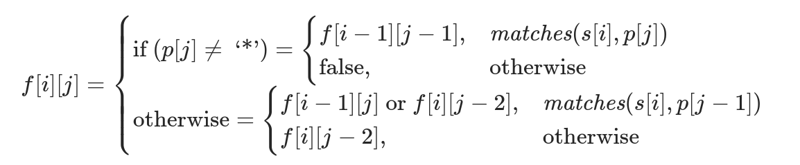

# 总结

## 滑动窗口

- 3; 

- 一定要记好框架.

    

## DP (正则匹配)

- 10: 我们用` f[i][j]`表示 s 的前 i 个字符与 p 中的前 j 个字符是否能够匹配

## 转换进制

- 12

## 回溯

- 要求输出所有组合就一定得回溯: 17; 22

## RK-算法的思想: 利用hash来进行字符串比较

- 30

# 题目

## Easy

### [13. 罗马数字转整数](https://leetcode-cn.com/problems/roman-to-integer/)

- `Date`: 2020/09/04-17 : 10
- `Time`: 15

### [14. 最长公共前缀](https://leetcode-cn.com/problems/longest-common-prefix/)

- `Date`: 2020/09/04-17 : 19
- `Time`: 12

### TODO KMP; RK[28. 实现 strStr()](https://leetcode-cn.com/problems/implement-strstr/)

- `Date`: 2020/09/04-18 : 01
- `Time`: 10
    - 注意暴力有一个坑: 就是当你比较目标子串时, 要保证原子串**剩余长度**不小于目标子串长度.
- `题解`
    - 暴力：逐个比较 / 双指针（只有第一个匹配上）
    - Rabin Karp：把字符串比较转化为哈希值比较

        - `如何在常数时间内生成子串的哈希码`: `滚动哈希` -> 滑动窗口
        - `abcd`->$0\times26^3+1\times26^2+2\times26+3\times26^0$.
        - 滑动窗口: $h_{n+1} = [h_n*a-c_0*(a^L\%modules) + c_{L+1}] \% modules$
        - 为了避免溢出,取模. (此问题中$2^{31}$)
    - KMP: 

### [38. 外观数列](https://leetcode-cn.com/problems/count-and-say/)

- `Date`: 2020/09/04-19 : 28
- `Time`: 15
- `思路`: 递推; 类似`Fib`.

### [58. 最后一个单词的长度](https://leetcode-cn.com/problems/length-of-last-word/)

- `Date`: 2020/09/04-21 : 00
- `Time`: 10
- `思路` `strip()` + `split`

### [67. 二进制求和](https://leetcode-cn.com/problems/add-binary/)

- `Date`: 2020/09/04-21 : 07
- `Time`: 5 
- `思路`: `BigInteger`

## Median

### [3. 无重复字符的最长子串](https://leetcode-cn.com/problems/longest-substring-without-repeating-characters/)

- `Date`: 2020/08/14-10 : 52

- `Time`: X

- `题解`:

    > - 如果我们依次递增地枚举子串的起始位置, 那么子串的结束位置也是递增的, 可以使用滑动窗口.
    > - 假设我们选择字符串中的第 k个字符作为起始位置，并且得到了不包含重复字符的最长子串的结束位置为 r_k, 那么当我们选择第 k+1个字符作为起始位置时，首先从 k+1到 r_k的字符显然是不重复的

    - 判断是否有重复字符: 使用HashSet.

### TODO [5. 最长回文子串](https://leetcode-cn.com/problems/longest-palindromic-substring/)

- `Date`: 2020/08/14-11 : 09
- `Time`: X
- `题解`:
    - *暴力解法*: 枚举所有长度≥ 2 (当前max_len)的子串, 依次判断是否为回文串.
        - 暴力解法时间复杂度高，但是思路清晰、编写简单。优化的解法在很多时候，是基于“暴力解法”，以空间换时间得到的，因此思考清楚暴力解法，分析其缺点，很多时候能为我们打开思路。
    - *动态规划*: (递推)

### [8. 字符串转换整数 (atoi)](https://leetcode-cn.com/problems/string-to-integer-atoi/)

- `Date`: 2020/09/04-14 : 59
- `Time`: 23
- `思路`: `BigInteger`; `replaceAll`, 正则

### [10. 正则表达式匹配](https://leetcode-cn.com/problems/regular-expression-matching/)

- `Date`: 2020/09/04-15 : 32
- `Time`: X
- `题解`:
    - 我们用` f[i][j]`表示 s 的前 i 个字符与 p 中的前 j 个字符是否能够匹配
        - 前`i`个: 当前处理的元素下标为`i-1`
    - 

### [12. 整数转罗马数字](https://leetcode-cn.com/problems/integer-to-roman/)

- `Date`: 2020/09/04-16 : 52
- `Time`: X
- `题解`:
    - 把题目中提到的几个特殊情况也当做一个数位即可.

### [17. 电话号码的字母组合](https://leetcode-cn.com/problems/letter-combinations-of-a-phone-number/)

- `Date`: 2020/09/04-17 : 38
- `Time`: 20
- `思路`: 回溯.

### [22. 括号生成](https://leetcode-cn.com/problems/generate-parentheses/)

- `Date`: 2020/09/04-17 : 52
- `Time`: 15
- `思路`: 回溯

### [49. 字母异位词分组](https://leetcode-cn.com/problems/group-anagrams/)

- `Date`: 2020/09/04-20 : 52
- `Time`: 15
- `思路`: 将字符串中的字母排序后作为键值.

### [71. 简化路径](https://leetcode-cn.com/problems/simplify-path/)

- `Date`: 2020/09/04-21 : 35
- `Time`: 20
- `思路`: `split`成数组后再操作, 不要让`/`干扰了你的想法.

### [91. 解码方法](https://leetcode-cn.com/problems/decode-ways/)

- `Date`: 2020/09/04-22 : 11
- `Time`: 20
- `思路`: 类似数零钱, 要关注的就是`我从哪来`中子问题是否成立.

### TODO [647. 回文子串](https://leetcode-cn.com/problems/palindromic-substrings/)

- `Date`: 2020/08/19-10 : 09
- `Time`: 1 h
- `思路`:
    - 暴力DP:
        - 状态定义: 
            - 状态定义为[i, j] 之间存在多少回文串**不可以**, 因为`dp[i][j]`取决与`dp[i-1][j-1]`中的回文串有没有用到s[i]和s[j]. (不满足无后效性)
            - 所以状态为串[i,j]是否为回文串.
        - `选择 / 我从哪里来`:
            - `[i,j]`取决于`[i+1,j-1]`: 递推的时候要确定子问题已经算出来了, 所以`i`要从大往小遍历, `j`要从小往大遍历.
    - `中心拓展`
        - 枚举中心, 两边拓展.
    - `Manacher 算法`
        - TODO

## Hard

### [30. 串联所有单词的子串](https://leetcode-cn.com/problems/substring-with-concatenation-of-all-words/)

- `Date`: 2020/09/04-17 : 38
- `Time`: X
- `题解`: 滑动窗口 + 用hash做字符串比对.

### [32. 最长有效括号](https://leetcode-cn.com/problems/longest-valid-parentheses/)

- `Date`: 2020/09/04-18 : 38
- `Time`: X
- `题解`: 看到**最**, 想一下`dp`
    - 这一题dp的状态 ->`dp[i]`表示以下标为 i 的字符结尾的最长有效子字符串的长度

```python
if s[i] == '(' :
    dp[i] = 0
if s[i] == ')' :
    if s[i - 1] == '(' :
        dp[i] = dp[i - 2] + 2 #要保证i - 2 >= 0

    if s[i - 1] == ')' and dp[i-1] > 0 and s[i - dp[i - 1] - 1] == '(' :#要保证i - dp[i - 1] - 1 >= 0
        dp[i] = dp[i - 1] + dp[i - dp[i - 1] - 2] + 2 #要保证i - dp[i - 1] - 2 >= 0
```

- 并不是所有dp的题里,你都知道最终答案是在哪一个状态处取到

### [44. 通配符匹配](https://leetcode-cn.com/problems/wildcard-matching/)

- `Date`: 2020/09/04-20 : 38

- `Time`: 15

- `思路`:

    - `DP`表达式要想清楚, 注意好边界条件, 别越界.

    - ```java
        if (p.charAt(j-1) != '*') {
        	if (match(s, p, i-1, j-1)) {
        		dp[i][j] = dp[i-1][j-1];
        	} else {
        		dp[i][j] = false;
        	}
        } else {
        	dp[i][j] = dp[i][j-1]; //不消去s[i-1]
        	if (i-1 >= 0)
        		dp[i][j] = dp[i][j] || dp[i-1][j]; //消去s[i-1]
        }
        ```

### [72. 编辑距离](https://leetcode-cn.com/problems/edit-distance/)

- `Date`: 2020/09/04-21 : 36
- `Time`: X
- `思路`:
    - 其实对两个串做操作是等价的, 故不妨记`dp[i][j]`为将A串前i个元素改为B串前j个元素的编辑距离.
        - 则`word[i-1]==word[j-1]`: `dp[i][j] = dp[i-1][j-1]`
        - 若`word[i-1]!=word[j-1]`: `dp[i][j] = 1 + min(dp[i-1][j-1], dp[i][j-1], dp[i-1][j])`:
            - 修改: `dp[i-1][j-1]`
            - 增加: `dp[i][j-1]`: 先将A的前i个变为B的前j个, 然后在A增加一个.
            - 删除:`dp[i-1][j]`先将A的前i-1个变为B的前j个, 然后在A删除一个.

### [87. 扰乱字符串](https://leetcode-cn.com/problems/scramble-string/)

- `Date`: 2020/09/04-21 : 59
- `Time`: X

### [97. 交错字符串](https://leetcode-cn.com/problems/interleaving-string/)

- `Date`: 2020/09/04-22 : 55
- `Time`: X
- `思路`: 

### [115. 不同的子序列](https://leetcode-cn.com/problems/distinct-subsequences/)

- `Date`: 2020/09/04-22 : 33
- `Time`: 20
- `思路`:
    - `DP`: `dp[i][j]`表示S的前i个字母中可以找到T的前j个字母的出现个数
        - $dp[i][j] = \left \{\begin{aligned}&dp[i-1][j],  &word[i-1]!=word[j-1]\\ &dp[i-1][j-1] + dp[i-1][j], &word[i-1] == word[j-1]\end{aligned} \right .$
            - 关于`dp`方程, 当`word[i-1]==word[j-1]`时, T的第[j-1]位可以用掉, 也可以不用.
    - 还有就是初始化条件
        - `dp[0][j] = 0`; `dp[i][0] = 1`
            - 解释一下后者, 这种只能从base case上看.
            - 假设 S = "te", T="t", 则看`dp[2][1] = dp[1][0]`, 故后者应该为1.