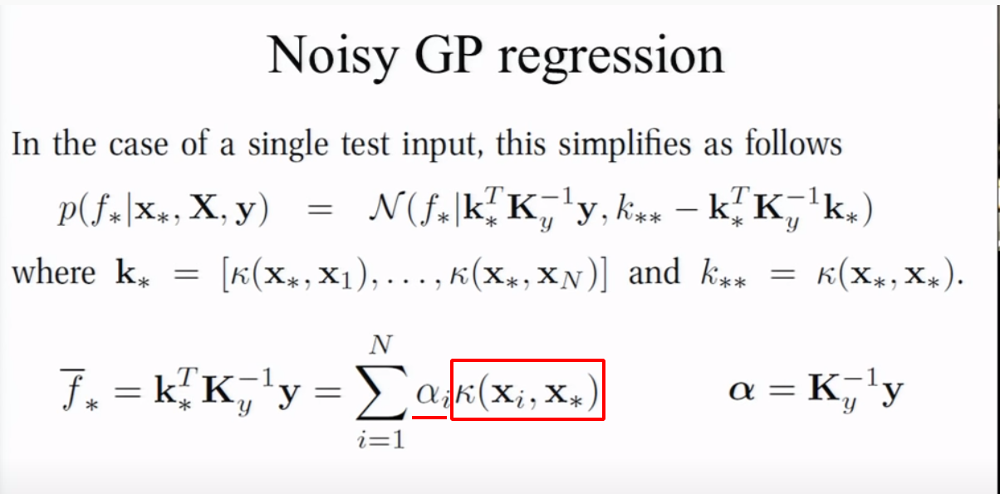

# [Introduction to Gaussian Process](https://www.youtube.com/watch?v=4vGiHC35j9s&feature=emb_logo)

## Gaussian Basics

- $x \sim N(\mu, \Sigma)$ 
  
    - 
    
    - $\Sigma$: covariance <-> $\rho$ : correlation 
        - $\rho_{x_1x_2} = \frac{Cov(x_1,x_2)}{\sigma_{x_1}\sigma_{x_2}} $
        - $Cov(x_1,x_2) = \mathbb{E}[(X_1-E(X_1))(X_2-E(X_2))]$
    

### Joint distribution && Conditional distribution  <--> Marginal distribution

- ]
- For Gaussian, $\Sigma$ is **symmetric** and **positive definite**. 

-  

### How to sample Gaussian data from uniform distribution:

- `Inverse Cumulative Sampling`:
    - 
    - 绿色的是高斯分布的Cumulative Distribution Function (累积分布函数) $\Phi(x)$, 所以从红色的uniform分布中sample出$x\sim[0,1]$, 然后逆映射$y = \Phi^{-1}(x)$, $y$符合高斯分布.

> Inverse Transfer Learning ([see](https://www2.isye.gatech.edu/~sman/courses/6644/Module07-RandomVariateGenerationSlides_171116.pdf))
>
> Theorem: Let $X$ be a continuous random variable with c.d.f. $F(x)$, then $F(X) \sim \mathcal{U}(0,1)$
>
> Proof: Let $Y = F(X)$ and has a c.d.f. $\mathcal{G}(y)$, then:
>
> $\mathcal{G}(y) = P(Y \leq y) = P(F(X) \leq y) = P(x \leq F^{-1}(y)) = F(F^{-1}(y)) = y$
>
> Then: Let $U \sim \mathcal{U}(0,1)$, given an arbitrary distribution with c.d.f. $F(x)$, then assign $X = F^{-1}(U)$, $X$ will have the distribution $F(x)$.
>
> 

- $X_i \sim N(0,1)$ <===> $X_i \sim N(\mu,\sigma^2) \sim \mu+\sigma N(0,1)$

- How to get samples from $X\in\mathbb{R}^n, X\sim N(\mu^n, \Sigma_{n\times n})$?
    - If each dimension is **independent**, it's easy, we just sample every dimension independently.
        - Note that: though that $p(x_1) \sim N(\mu_1,\Sigma_{11}), p(x_2) \sim N(\mu_2,\Sigma_{22})$ will always be true, **but only when $x_1, x_2$ are independent**, randomly sample $x_1 \sim N(\mu_1,\Sigma_{11}), x_2 \sim N(\mu_2,\Sigma_{22})$ will equal to sample $\begin{bmatrix}x_1 \\ x_2 \end{bmatrix}$ from the join distribution.
    - If not, we can still apply the trick in one-dimension case.
        - $X\sim \mu+L\cdot N(0, I)$. $L$ is the "square root" of $\Sigma$. (Cholesky decomposition, $\Sigma=LL^T$)
        - For $N(0,I)$, every dimension is independent. 

## Gaussian Process

- An intuitive assumption: 
    - If $x_i$ and $x_j$ are close to each other, then $y_i$ and $y_j$ should be close too.
    - We use kernel function to measure the **similarity of $x$ **.
- If we have two known data $(x_1,f_1), (x_2,f_2)$, let's say it comes from 
    - $\begin{bmatrix}f_1 \\ f_2 \\\end{bmatrix} \sim N(0, \begin{bmatrix}K_{11} & K_{12} \\ K_{21} & K_{22}\\ \end{bmatrix}) = N(0, \mathbf{K})$ 
    - :warning: $k$ is all calculated with **kernel function**.
    -  Then we want to predict $y_*$ given $x_*$, let's **assume it comes from** $y_*\sim N(0,k(x_*,x_*)) = N(0, K_{**})$, where $k(\cdot, \cdot)$ is a kernel function, e.g. $k(x_i, x_j) = \sigma^2 * exp(-\lambda||x_i - x_j||)$
    - And we think $f_1,f_2$ and $f_*$ are correlated, so we get $\begin{bmatrix}f_1\\f_2\\f_*\\\end{bmatrix} \sim N(0, \begin{bmatrix}\mathbf{K} & & K_{1*} \\ & & K_{2*} \\ K_{*1} & K_{*2} & K_{**}\end{bmatrix})$, let's call $\begin{bmatrix}K_{1*} \\ K_{2*}\\\end{bmatrix} = K_*$ and $f = \begin{bmatrix}f_1 \\ f_2\\\end{bmatrix}$

- Then we can *apply Multivariate Gaussian Theorem* to get **$P(y_* | (x_1,f_1), (x_2,f_2))$**
    - $\mu_* = K_*^T\mathbf{K}^{-1}f$
    - $\sigma_* = -K_*^T\mathbf{K}^{-1}K_* + K_{**}$ 

### The core of GP

- The core is assume $\begin{pmatrix}f_1 \\ \vdots \\ f_N\end{pmatrix} \sim N(\mu, \mathbf{K})$, where $\mu = \mathbb{E}[f(x)]$ and $\mathbf{K}_{N\times N} =[k(x_i,x_j)] $.

#### Meaning 1:

- Arbitrary choosing $X_{1:N}$ **and $\mu$**, you get a multi-dimension distribution $N(\mu, \mathbf{K})$, drawing samples from that distribution can get you a line :$(x,f)$.
- $\mathbf{K}$ only stands for the **smoothness assumption** in GP, so $N(\mu_{\text{arbitrary}}, \mathbf{K})$ is just a collection of random smooth functions !  --> **GP is a Gaussian distribution over functions!**  
    - You can assume **$f$ is centralized**, i.e. $\mu = 0\text{ for } f, f_*$. (But you have to actually do that, e.g. estimate $\mathbb{E(f(x))}$ then minus it ,otherwise the data you observed won't be centralized)
    - GP defines a **function distribution**, i.e. $f(x) \sim \mathcal{GP}(\mathbb{E}[f(x)], \mathbf{K}$
- 

#### Meaning 2:

- Arbitrary choosing $x_*$, using collected data $(x,f)$, you can predict the conditional distribution $p(f_*|x_*, (x,f))$ (Note that $\mu, \mu_* \text{ is related to } \mu(X) \text{ and } \mu(X_*)$)

- Gaussian Posterior: make predictions
    - $p(f|D) = \frac{p(D|f)p(f)}{P(D)}$
    - Prior Knowledge: $y_i \text{ and } y_j$ are close when $x_i$ and $x_j$ are close.

## Noiseless GP Regression

- $\mu'$ and $\mu_*^{'}$ are priors. (Either estimate from training data, or assume to be zero -> for centralized data.)
    - $\mu_*$ and $\Sigma_*$ are para of **conditional distribution!**  

# [Gaussian Process](https://www.youtube.com/watch?v=MfHKW5z-OOA&list=PLE6Wd9FR--EdyJ5lbFl8UuGjecvVw66F6&index=9)

## Active Learning with GPs

- The key in GP is the belief that `Most functions are smooth`
- Noiseless GP regression:
    - $\mathcal{k}(x,x') = \sigma^2_fexp(-\frac{1}{2l^2}(x-x')^2)$

## Effect of Kernel with Parameters

- `the red one is the fitting function, ane the blue is the truth`:
    - When `l` is **small**, the fitting function tends to be **less smooth**
        - Kernel K is more sensitive to $(x-x')^2$
    - $\sigma_f$ controls the vertical variation of functions drawn from the GP
- One way to set this parameters is to do *cross validation*.

## Noisy GP Regression

-  $y = f(x) + \epsilon$, where $\epsilon \sim N(0, \sigma^2_{y})$ ($y$ is what we observed , but $f$ is ground truth, or **hidden parameter**)
    -  $f_i$s are not independent, but $(y_i|f_i)$s are independent.
    -  $f_i = f(x_i), \text{so } p(\cdot|f,X) = p(\cdot|f(x)) = p(\cdot|f)$

$$
p(y|X) = \int p(y,f|X)df = \int p(y|f,X)p(f|X)df\\
p(f|X) = N(f|0, \mathbf{K}) \text{ # Note: f is centralized, and they're not independent} \\
p(y|f,X) = p(y|f) = \prod_i N(y_i|f_i,\sigma^2_y)\\ %y_i is independent with each other
cov[y|X] = \mathbf{K} + \sigma_y^2 \mathbf{I}_N \triangleq \mathbf{K}_y
$$

- Then we acquire GP with noise:

$$
\begin{pmatrix}\mathbf{y}\\f_*\end{pmatrix} \sim N(0, \begin{pmatrix} \mathbf{K_y} & \mathbf{K_{*}} \\ \mathbf{K^T_{*}} & \mathbf{K_{**}} \\ \end{pmatrix}) \\
\begin{aligned}
	p(f_*|x_*,X,y) &= N(f_*|\mu_*, \Sigma_*)\\
	\mu_* &= \mathbf{K_*^T}\mathbf{K_y^{-1}}y\\
	\Sigma_* &= \mathbf{K_{**}} - \mathbf{K}_*^T\mathbf{K_y}^{-1}\mathbf{K_*} 
\end{aligned}
$$

- Only $\mathbf{K}$ becomes $\mathbf{K_y}$:

    - $\sigma_y^2$ needs to be **estimates from data**, MLE, cross-validation, Bayesian Learning for example.

    - You need to choose a robust prior for $\sigma_y^2$.

    - > 在保留交叉验证（**hand-out cross validation**）中，随机将训练样本集分成训练集（training set）和交叉验证集（cross validation set）,比如分别占70%，30%。然后使用模型在训练集上学习得到假设。最后使用交叉验证集对假设进行验证，看预测的是否准确，选择具有误差小的模型。
        >
        > k折交叉验证（**K-fold** **cross validation**），就是把样本集S分成k份，**分别**使用其中的(k-1)份作为训练集，剩下的1份作为交叉验证集，最后取最后的平均误差，来评估这个模型。 (即每一份都需要作为验证集, 训练时间变为了原来的k倍)
        >
        > 留一法（**leave one out， LOO**）就是m-fold cross validation，m是样本集的大小，就是只留下一个样本来验证模型的准确性。
        >
        > 
        >
        > 作者：Chown
        > 链接：https://www.zhihu.com/question/39259296/answer/91866308
        > 来源：知乎

### Another interpretation of GP

- So the mean $\mu_* = \bar{f_*}$ is actually a **linear combination of basis functions** ($k(x_i,x_*)$)

### Noisy GP regression and Ridge

- Ridge regression $\triangleq$ linear regression with $L_2$ norm.

- $\min\limits_{\theta\in\mathbb{R}^d} ||y-X\theta||^2_2 + \delta^2||\theta||_2^2$, where $X\in\mathbb{R}^{n\times d}$ and $y \in \mathbb{R}^d$ ($n$ is sample numbers, and $d$ is feature numbers)

- and the solution is $(X^TX+\delta^2\mathbf{I})\theta = X^Ty$

    - i.e. $\theta=X^T\alpha, \text{ where } \alpha=\delta^{-2}(y-X\theta)$   , where $\theta\in\mathbb{R}^{d\times1}$
    - i.e. $\alpha=(XX^T+\delta^2\mathbf{I}_n)^{-1}y$  , where $\alpha\in\mathbb{R}^{n\times1}$
        - Whether to compute $\alpha$ or $\theta$ depends on $n$ and $d$ which one is larger.

- Get back to GP:

    - $$
        \begin{aligned}
        y^* &= x^*\theta\\
        &= x^*X^T\alpha\\
        &= x^*X^T[XX^T+\delta^2\mathbf{I}]^{-1}y\\
        & \text{ Compared with GP : }{k_*^{T}K_y^{-1}y}
        \end{aligned}
        \\
        \begin{aligned}
        &\text{where } XX^T = \begin{bmatrix}x_1\\\vdots\\x_n\end{bmatrix}\begin{bmatrix}x_1^T&\cdots&x_n^T\end{bmatrix}\\
        &\text{where } x_i \in \mathbb{R}^{1\times d} \text{ is a sample.} \\
        &\\
        &\text{and the dot product } x_i\cdot x_j \text{ can also be interpreted}\\
        &\text{as similarity, i.e. it's a linear kernel funciton.}
        \end{aligned}
        $$

    - Ridge regression is **a GP**.
      
        - $\delta$ in Ridge is like the $\sigma_y$ we introduce at noisy GP.

## Learning the kernel parameters 

- $$
    p(y|X) = \int p(y,f|X)df = \int p(y|f,X)p(f|X)df\\
    p(f|X) = N(f|0, \mathbf{K}) \\
    p(y|f) = \prod_i N(y_i|f_i,\sigma^2_y)\\ %y_i is independent with each other
    $$

    - Here $f$ is a hidden variable, and $p(y|X)$ is marginal likelihood:
        - Although what we care about is $f$, but since we can only **acquire $y$,** therefore we need to calculate $p(y|X)$ and maximize it.
            -  We need to do integration to get ride of $f$, $f$ can be interpreted as hidden parameters.)

- Doing MLE:

    - 
    - Where $\theta$ is parameter of your kernel function. 
        - So you actually doing optimization w.r.t data, so this is empirical based. 

## Numerical computation considerations

# [Bayesian optimization and multi-armed bandits](https://www.youtube.com/watch?v=vz3D36VXefI&list=PLE6Wd9FR--EdyJ5lbFl8UuGjecvVw66F6&index=10)

## Warning: Don't use GP everywhere.

- GP is just a model (a collection of functions).
- So you should use GP **if and only if** your target functions are **smooth.**
- For multi-arm bandit, it's not reasonable to assume that your target functions are smooth, instead, you should model a distribution for each bandit (e.g. beta distribution)

## Preliminaries

- Trade-off between exploration and exploration.
- Regret = Player reward - Reward of best action.
- Bayesian Optimization:
    - Find optimal point $x_t$ for the next query based on utility function / acquisition function $u(x|\mathcal{D}_{1:t-1})$
    - Then update $u$ with $(x_t, y_t)$ based on Bayes' rule.

## Exploration-exploitation trade-off

$$
\textbf{Gaussian Prediction}\\
\begin{aligned}
p(y_{t+1}|\mathcal{D}_{1:t},x_{t+1}) &= N(\mu_t(x_{t+1}), \sigma^2_t(x_{t+1}))\\
\mu_t(x_{t+1}) &= \mathbf{k}^T[\mathbf{K}+\sigma^2_{noise}\mathbf{I}]^{-1}y_{1:t}\\
\sigma^2_t(x_{t+1}) &= k(x_{t+1},x_{t+1}) - \mathbf{k}^T[\mathbf{K}+\sigma^2_{noise}\mathbf{I}]^{-1}\mathbf{k}
\end{aligned}
$$

- We should choose next $x$ with high mean (exploit) and high variance (exploration)
    - e.g. $\mu(x)+\alpha\sigma(x)$

## Acquisition Functions

### Probability of Improvement

- $$
    \begin{aligned}
    PI(x) &= p(f(x) \geq \mu^+ + \xi)\\
    &= \Phi(\frac{\mu(x)-\mu^+-\xi}{\sigma(x)})\\
    \end{aligned}
    $$

- The probability of $x$ to be greater than $\mu^+$ (the best result we have observed so far).

### An expected utility criterion

#### Bayes and decision theory

- We need **two** components:
    - A probabilistic model of the environment: a posterior.
    - Utilitarian: make decisions based on the posterior. (e.g. acquisition function)
- e.g.
    - The expected utility is : $EU(a) = \sum_{x}u(x,a)P(x|data)$  <-- posterior
        - Just like RL.
    - Then your decision might be: $argmax_{a}EU(a)$  <-- decision

#### An expected utility criterion

- We minimize the distance to the optimal point $x^* = argmax_xf(x)$.

- $$
    \begin{aligned}
    x_{n+1} &= \arg\min\limits_{x}\mathbb{E}(||f_{n+1}(x)-f(x^*))||\ |\mathcal{D}_n)\\
    &= \arg\min\limits_x\int||f_{n+1}(x)-f(x^*))||p(f_{n+1}|D_n)df_{n+1}
    \end{aligned}
    $$

    - Here we integrate over all possible functions.

- But we don't know $f(x^*)$, so instead:
  
    - 

### A third criterion: GP-UCB

- [GP-UCB](https://arxiv.org/abs/0912.3995)

### A fourth criterion: Thompson sampling

## Usage of Bayesian Optimization

