# PRML

## 1. Introduction

- $\underbrace{Preprocess}_{\text{feature extraction}}$->$Learning\ Algorithm$->$Model$.
- $Supervised\left \{\begin{aligned}&classification\\&regression\end{aligned} \right.$
- $Unsupervised\left \{\begin{aligned}&clustering\\&density\ estimation&\\&visualization&\\&generation\end{aligned} \right.$
- $Reinforcement\left \{\begin{aligned}&credit\ assignment\\&exploration\\&exploitation\end{aligned} \right.$
  - Credit assignment: the reward must be properly assigned to every move that leads to it.
- Key ideas and tools: probability (quantify and manipulate uncertainty); decision (make optimal decisions); information theory.

### 1.1. Example: Polynomial Curve Fitting

- Causes of noise: *random noise* or *sources of unobserved variability*.
- Root-mean-square error: $R_{RMS}=\sqrt{\frac{2E(w^*)}{N}}$.
- Why high order polynomial tends to **over-fitting**?
  - Strange because: high order polynomials actually contains low order ones; The Taylor formula of target functions is actually infinite order polynomials.
  - One interpretation: 
    - As order increases, the **magnitude** of the coefficients gets larger.
    - The more flexible polynomials with larger order are becoming increasingly tuned to the random noise on the target values.
  - The over-fitting problem becomes less severe as the size of training set increasing.
  - *Regulations*: $\frac{\lambda}{2}||w||^2$.
    - $w_0$ should not be included or with its own $\lambda$.
  - Model selection: *validation set* or *hold-out set*.
- The number of parameters should not be determined by the size of data set, but the **complexity of the problem**. (Bayesian approach.)

### 1.2. Probability Theory

- *sum rule*: $\underbrace{P(X)}_{\text{marginal}}=\int \underbrace{P(X,Y)}_{\text{joint}}dy$.
- *product rule*: $P(X,Y)=p(Y|X)p(X)$.
- *Bayes rules*: $p(Y|X)=\frac{p(X|Y)p(Y)}{\sum\limits_Yp(X|Y)p(Y)}$.
  - Estimate probability distribution from data.

#### 1.2.1. Probability Densities

- Terminologies: probability densities function; probability mass function (discrete); cumulative density function.

- Variable change:

  - Assume $x=g(y)$, $p_x(x)dx\approx p_y(y)dy\rightarrow p_y(y)=p_x(x)|\frac{dx}{dy}|=p_x(g(y))|g'(y)|$.

  - > The concept of the **maximum** of a probability density is dependent on the choice of the variable.

#### 1.2.2. Expectations and covariances

- $\mathbb{E}_x[f(x,y)]$ is a function of $y$.
- *Conditional expectation:* $\mathbb{E}_x[f|y]=\sum\limits_xf(x)p(x|y)$.
- (Co)variances:
  - $var[x]=\mathbb{E}[(x-\mathbb{E}[x])^2]=\mathbb{E}[x^2]-\mathbb{E}[x]^2$
  - $cov[x,y]=\mathbb{E}_{x,y}[(x-\mathbb{E}[x])(y-\mathbb{E}[y])] = \mathbb{E}_{x,y}[xy]-\mathbb{E}[x]\mathbb{E}[y]$.

#### 1.2.3. Bayesian Probabilities

- Classical or frequentist interpretation of probabilities:
  - Frequencies of random, repeatable events.
  - The parameter $w$ is fixed, whose value is determined by "estimator", and error/likelihood of the "estimator" are obtained by considering the distribution of data set $\mathcal{D}$.
    - MLE; Bootstrap (with replacement).

- Bayesian probabilities:
  - **Quantified expression of uncertainty**.
  - $posterior\propto likelihood \times prior$
  - There's only a single data set $\mathcal{D}$ and *the uncertainty in the parameters* is expressed through a probability distribution over $w$.
  - **Prior**: debatable; usually chose for mathematical conveniences; significant related to model's performances; noninformative priors (try to alleviate the importance of the prior).
  - Need integrate / sum over the whole parameter space (sampling method: e.g. MC)
    - $p(y|x,Data)=\int_\theta p(y|x,\theta)p(\theta|Data)d\theta$
  - Deterministic approximation schemes: variational Bayes; expectation propagation.

#### 1.2.4. The Gaussian Distribution

- $\mathcal{N}(x|\mu,\Sigma)=\frac{1}{(2\pi)^{\frac{D}{2}}}\frac{1}{|\Sigma|^{\frac{1}{2}}}exp\{-\frac{1}{2}(x-\mu)^T\Sigma^{-1}(x-\mu)\}$.
  - And we might use $\beta=\frac{1}{\sigma^2}$ to denote the *precision*.
- For a data set with $N$ observation, MLE is actually maximizing the probability of data given the parameter (not the other way round, but these two criteria are actually related).
  - The log likelihood: 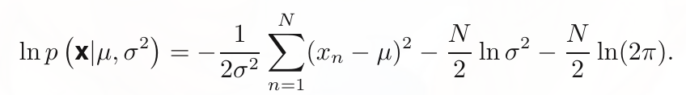
  - $\mu_{ML}=\frac{1}{N}\sum\limits_{n=1}^Nx_n$, $\sigma^2_{ML}=\frac{1}{N}\sum\limits_{n=1}^N(x_n-\mu_{ML})^2$.
  - But we can see: 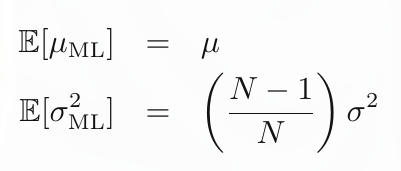, which means MLE is actually **BIASED** on variance estimation (for that it's measured relative to the sample mean rather than the true mean.), and this lies at the **root of the over-fitting problem in earlier polynomial curve fitting**.

#### 1.2.5. Curve Fitting Re-visited

- Bayesian interpretation: **we can express our uncertainty over the value of the target variable using a probability distribution.**
  - $p(t|x,w,\beta)= \mathcal{N}(t|y(x,w), \beta^{-1})$, which is the *predictive distribution*, we use its **expectation** for prediction.
  - 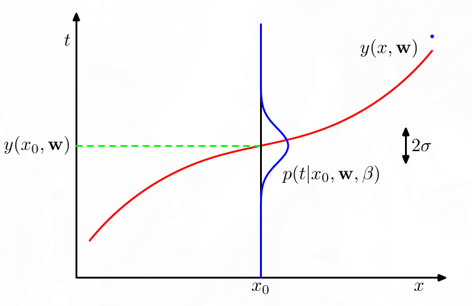
- The (log) likelihoods are:
  - 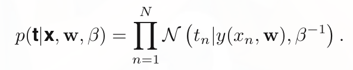 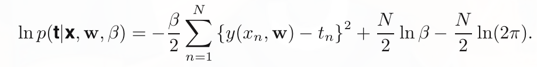
- **Maximize the log likelihood** (the probability of data given parameter)
  - Maximize likelihood w.r.t. $w$ is actually **minimize the sum-of-squares error function**. (L2 norm)
  - Maximize likelihood w.r.t. $\beta$: 
    - But we don't actually need it, because we don't use $\beta$ when doing prediction.
- **Maximize the posterior** (the probability of parameter given data) 
  - Prior: we choose a prior for the coefficients $w$, where $\alpha$ is the precision of the distribution:
    - 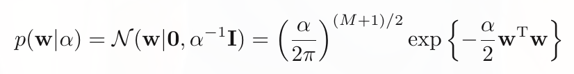
  - $p(w|\mathbf{x},\mathbf{t},\alpha,\beta)\propto p(\mathbf{t}|\mathbf{x},w,\beta)p(w|\alpha)$: maximize the posterior (**MAP**)
    - It's equivalent to minimize: 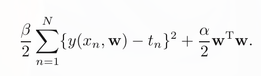. (ridge regression with $\lambda=\frac{\alpha}{\beta}$)

####  1.2.6. Bayesian Curve Fitting

- In previous discussion we are actually making **point estimation** (we assume it has a value) of $w$, what if we consider it as a random variable (with distribution).
- For simplicity, we assume $\beta, \alpha$ are fixed and known:
  - $p(t|x,\mathbf{x},\mathbf{t})=\int p(t|x,w)\underbrace{p(w|\mathbf{x},\mathbf{t})}_{\text{posterior}}dw$. (Note that the posterior needs to be normalized.)
- In the polynomial curve fitting example, the uncertainty (variance) now is not only $\beta^{-1}$, but also has term that comes from the uncertainty in the parameter $w$.

### 1.3. Model Selection

- validation set; test set (if the model will be trained and test on validation set iteratively, then test set is for **final** evaluation).
- *(k-folder) cross-validation*: train $k$ models.
  - Drawback: $k$ time slower; multiple complexity parameters might need to testing for exponentially large combinations.
- Information criteria: Adding a penalty term to compensate for the over-fitting (caused by the bias in MLE).
  - $\left\{\begin{aligned}&\text{Akaike information criterion (AIC)}\\&\text{Bayesian information criterion (BIC).}\end{aligned}\right.$
  - However in practice these methods usually favor overly simple models.

### 1.4. The Curse of Dimensionality

- Something different w.r.t to high dimensions:
  - Exponential data / parameters.
  - Most volume of a sphere is concentrated in a thin shell near the surface in high dimension.
  - The probability mass of the Gaussian is concentrated in a thin shell in high dimension.
- Two good properties of real data to conquer the "curse":
  - Only partial dimensions are effective.
  - (At least locally) smoothness properties, we might exploit local interpolation-like (局部插值) techniques.

### 1.5. Decision Theory

- *Inference* (get $p(x,t)$ from the data set) and *decision* (prediction of $t$).
- In the binary classification problem: $\underbrace{p(C_k|x)}_{\text{posterior}}=\frac{p(x|C_k)\overbrace{p(C_k)}^{\text{prior}}}{p(x)}$ (can all be obtained from $p(x,C_k)$ in *inference*). Intuitively we want to choose $C_k$ with maximum posterior probability, following are some more general criteria. 

#### 1.5.1. Minimizing the Misclassification Rate

- 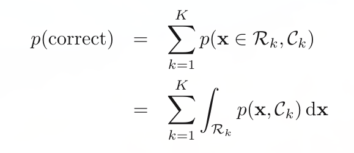; which means each $x$ should be assigned to the class $C_k$ that has the largest $p(x,C_k)$, i.e. largest posterior probability $p(C_k|x)$.

#### 1.5.2. Minimizing the Expected Loss 

- Different types of misclassification might have different consequences, which we aim to capture with *loss function* $L_{kj}$ (misclassify $k$ for $j$). The loss function depends on the **true class**, which we don't know, but **the uncertainty in the true class** is expressed through $p(x,C_k)$.
- Expected loss $\mathbb{E}[L] = \sum\limits_k\sum\limits_j\int_{\mathcal{R}_j}L_{kj}p(x,C_k)dx$, minimizing $\mathbb{E}[L]$ equals to chose $\mathcal{R}_j$ for each $x$ to minimize $\sum\limits_kL_{kj}p(x,C_k) = \sum\limits_kL_{kj}p(C_k|x)$.

#### 1.5.3. The Reject Option

- Sometimes it's better to reject when we are uncertain about class membership (e.g. $\max\limits_{k}p(C_k|x)\leq \underbrace{\theta}_{\text{threshold}}$).

#### 1.5.4. Inference and Decision

Three ways for solving **classification** problems (decreasing complexity):

- (a) Infer class-conditional densities $p(\mathbb{x}|C_k)$; prior class probabilities $p(C_k)$; and normalizer $p(\mathbb{x}) =\sum\limits_k p(\mathbb{x}|C_k)p(C_k)$.
  - Then we can acquire **posterior probabilities** $p(C_k|\mathbb{x})$, and use *decision theory* to get the prediction.
  - Equivalently, we can model *joint distribution* $p(\mathbb{x},C_k)$ directly and then normalize to obtain posterior probabilities.
  - Approaches that explicitly or implicitly model the distribution of *inputs ($p(x)$) as well as outputs ($p(C_k)$)* are known as **generative models**.
- (b) Infer posterior class probabilities $p(C_k|\mathbb{x})$ and then use decision theory for prediction.
  - Approaches model the posterior probabilities directly is called **discriminative models**.
- (c) Find discriminant function $f(x)$ mapping directly to class label.

Pros and Cons of those three methods:

- In method (a):
  - $p(\mathbb{x})$ can be used for *outlier detection* or *novelty detection* (data point with low probability.)
- If we only want to make classification decisions, we in fact only need $p(C_k|\mathbb{x})$ from (b) rather than $p(\mathbb{x},C_k)$ from (a) -> we do some redundant work e.g. estimate $p(\mathbb{x}|C_k)$.
- When applying discriminant function $f(x)$, there are some **pros we no longer have** for that we don't have the posterior probabilities.
  - Minimize risk: We can manipulate $\sum\limits_kL_{kj}p(C_k|x)$ properly to denote risk.
  - Reject option.
  - Compensating for class priors:
    - E.g. In cancer detection, regular data set might only contains few images with cancer, so we might want to modify the proportion of cancer and non-cancer images to acquire better classification model. After that, when we apply model **to a real data set**: we can divide the learned posterior by prior class probabilities $p(C_k)$ of training data set and then multiply the $p(C_k)$ of the real data set (approximately the class fraction). Finally after normalization we can acquire the posterior for the real data set.
  - Combining models:
    - We might want to use different models for handling different subsets of features.
    - Conditional independence assumption / Naive Bayes model:
      - $p(\mathbb{x}_I,\mathbb{x}_B|C_k) = p(\mathbb{x}_I|C_k)p(\mathbb{x}_B|C_k)$
      - 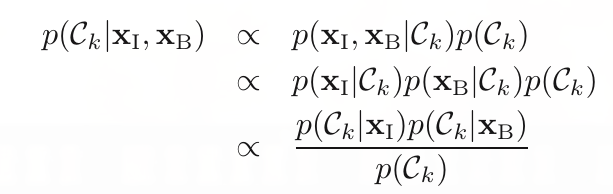

#### 1.5.5. Loss Function for Regression

- In regression problem, the expected loss is:
  - $\mathbb{E}[L]=\int\int L(t,y(\mathbb{x}))p(\mathbb{x},t)d\mathbb{x}dt \overbrace{\rightarrow}^{Squared \, Error} \int\int \{y(\mathbb{x})-t\}^2p(\mathbb{x},t)d\mathbb{x}dt$.
- Assume a completely flexible function $y(\mathbb{x})$, we want to minimize the loss for *every $\mathbb{x}$*:
  - 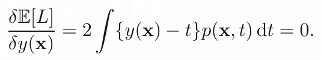
  - 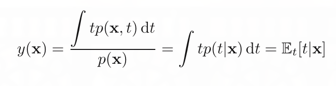

- So the optimal prediction is the conditional average $y(\mathbb{x})=\mathbb{E}_t[t|\mathbb{x}]$.
- Another way to interpret this:  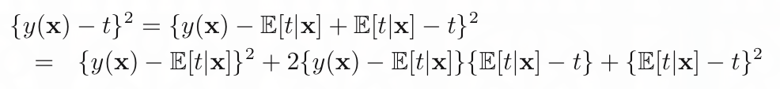
  - And we can acquire ([proof(https://stats.stackexchange.com/questions/228561/loss-functions-for-regression-proof?answertab=votes#tab-top)]): 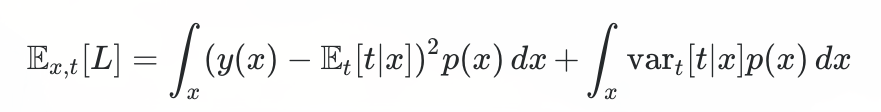
  - Where the second term represents the intrinsic variability of the target data (noise) and is the irreducible minimum value of the loss function.

- Three ways for solving **regression** problems (decreasing complexity):
  - Infer $p(\mathbb{x},t)$ and then normalize to get $p(t|\mathbb{x})$ and finally $\mathbb{E}_t[t|\mathbb{x}]$.
  - Infer $p(t|\mathbb{x})$ and finally $\mathbb{E}_t[t|\mathbb{x}]$.
  - Model regression function $y(\mathbb{x})$ directly.
- Different choices of losses:
  - *Minkowski loss*: 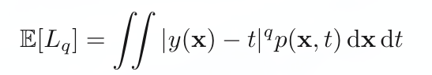

### 1.6 Information Theory

- How much *information* is received when we observe a specific value for this variable can be viewed through **'degree of surprise'** on learning the value of $x$. (Low probability events contain more information)
  - The information gain from two unrelated events should be the sum of each information (and probability is $p(x,y)=p(x)p(y)$) so the information matrix should be in the form of **logarithm**. (But the basis is arbitrary, in computer science we use $2$).
- Interpretations of **entropy**:
  - Average amount of **information** transferred: $H[x]=\mathop{\mathbb{E}}\limits_{x}[info(x)]=-\sum\limits_{x}p(x)log_2x$. 
    - e.g. A random variable with 8 possible values ($3$ bits for transferring), then $H(x)=3$.
  - The **lower bound** on the number of bits needed to transmit the state of a random variable.
  - A measure of **disorder** in thermodynamics (热力学):
    - The number of microstate(微观态) in macrostate(宏观态): consider $N$ identical objects to be divided into $m$ bins, such that there are $n_i$ objects in the $i^{th}$ bin.
    - Multiplicity (the number of microstate): $W=\frac{N!}{\mathop\Pi\limits_in_i!}$
    - The entropy is $W$ scaled by an appropriate constant (Note: $ln N!\approx NlnN-N, if\ N\rightarrow \infty$)
      - $H=\frac{1}{N}lnW=-\lim\limits_{N\rightarrow\infty}\sum\limits_i\frac{n_i}{N}ln\frac{n_i}{N}=-\sum\limits_{i}p_ilnp_i$.
      - 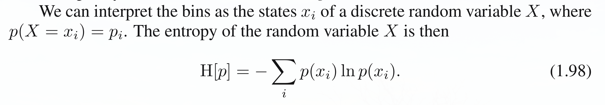

- *Differential* and *discrete* entropy:
  - For discrete entropy: the maximum entropy is achieved through **uniform distribution**.
    - Can be proved through Lagrange multiplier.
  - For differential entropy (continuous entropy, $H[x]=-\int p(x)ln p(x)dx$ ), many distribution (e.g. uniform) will have **unconstrained** entropy without limitations, so the maximum can not be well defined unless we make some constraints.   
    - 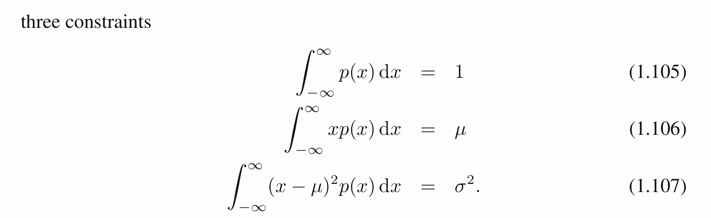
    - The maximum entropy is achieved through **Gaussian Distribution** ($H[x]=\frac{1}{2}[1+ln(2\pi\sigma^2)]$), which can be negative.
- Additional information:
  - Conditional entropy of $y$ given $x$: $H[y|x]=-\int\underbrace{\int p(y,x)ln p(y|x)dy}_\text{Given x} dx$.
    - additional information needed to specify the corresponding value of $y$ given $x$ is $-logp(y|x)$.
    - $H[x,y]=H[y|x]+H[x]$.

## 2. Probability Distribution

*Density estimation*: model the probability distribution $p(x)$ given a **finite** set.

*Conjugate priors* $\leftrightarrow$ *likelihood*: the posterior will have the same functional form.

$\left\{ \begin{aligned}&\text{Parametric (para that controls distribution will also has distribution in Bayesian)} \\ &\text{Nonparametric (might still have para to control complexity)}\end{aligned}\right .$

### 2.1. Binary Variables

- *Bernoulli distribution:* 

### 2.2. 