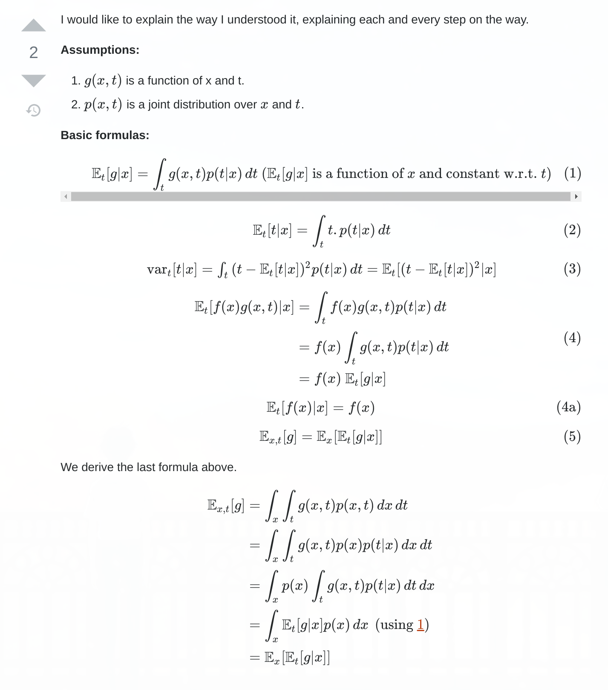
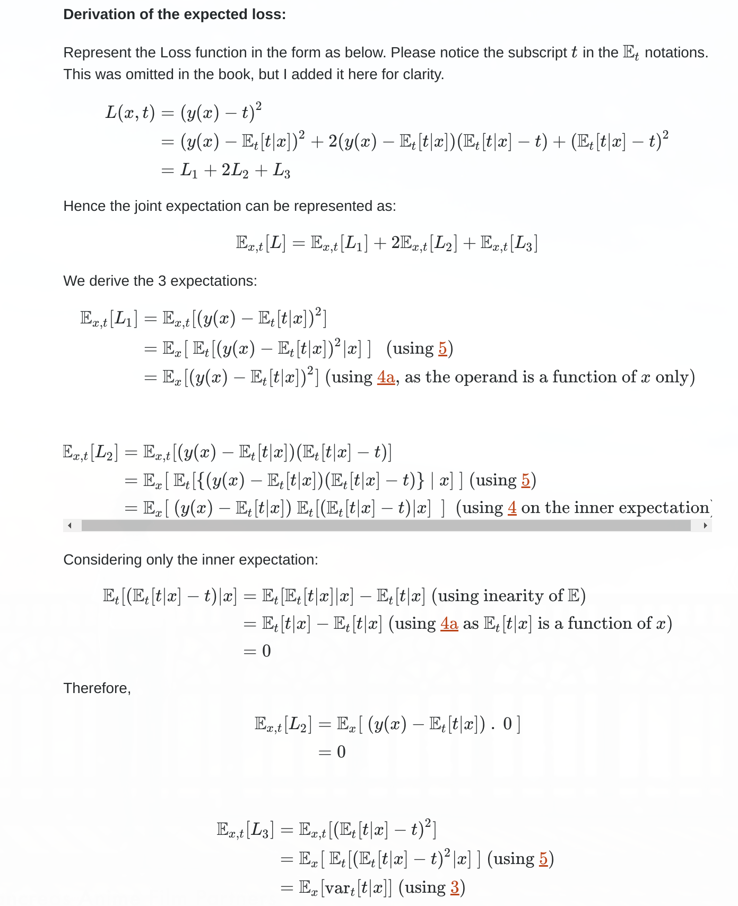
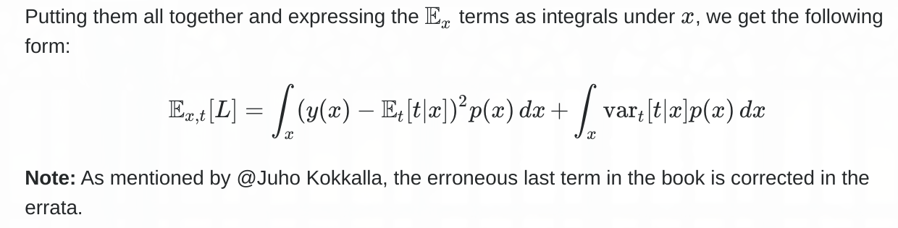

## 1.5.5. Loss function for regression p47

- [link](https://stats.stackexchange.com/questions/228561/loss-functions-for-regression-proof?answertab=votes#tab-top)
- 

## 2.3. matrix $\Sigma$ can be taken to be symmetric p80

- [link](https://math.stackexchange.com/questions/2262171/we-note-that-the-matrix-%CE%A3-can-be-taken-to-be-symmetric-without-loss-of-general)

## 2.3. The symmetric matrix can be expressed as an expansion in terms of its eigenvectors p80

- [link](https://math.stackexchange.com/questions/331826/expressing-a-matrix-as-an-expansion-of-its-eigenvalues)
- 

## 2.3. The determinant of a matrix can be written as the product of its eigenvalues p82

