Video: https://www.youtube.com/watch?v=rVfZHWTwXSA&list=PLoROMvodv4rMiGQp3WXShtMGgzqpfVfbU

Notes: http://cs229.stanford.edu/syllabus-autumn2018.html

# Lecture 3 - Locally Weighted & Logistic Regression

## 3.1. Linear Regression (Recap)

- $$
    \begin{aligned}
    (x^i,y^i)->&\text{i}th \text{ example}\\
    x^i \in \mathbb{R}^{n+1}&, y^i\in\mathbb{R}\\
    m = \#example&, y =\#features\\
    h_{\theta}(x)=\sum\limits_{j=0}^n \theta_jx_j &= \theta^Tx,  \text{where }x_0 \triangleq 1, \text{for that }x_0\theta_0 \triangleq b \\
    J(\theta) = \frac{1}{2}\sum\limits_{i=1}^m&(h_\theta(x^i)-y^i)^2\\
    \end{aligned}
    $$
    
- The professor use a fake feature $x_0 = 1$, which we usually refer to as the bias $b$.

## 3.2. Locally Weighted (Linear) Regression

- Parametric Learning algorithm:

    - Fix **fixed** set of parameters $\theta_i$ for data. e.g. Linear regression.

- Non-parametric Learning algorithm:

    - Amount of **data**/**parameters** you need to **keep** grows (linearly) with the size of data.

- Locally weighted regression:

    - (Fit $\theta$ with **data close to your prediction point**)

        - Maybe think about the case where you want to fit a non-linear with linear regression, it's more reasonable to only focus on the neighborhood.

    - $$
        \text{Fit }\theta\text{ to minimize}\\
        \sum\limits_{i=1}^m\omega^i(y^i-\theta^Tx^i)^2\\
        \text{where } \omega^i \text{ is a "weight" function}, \text{ a common choice is :}\\
        \omega^i = exp(-\frac{(x^i-x)^2}{2\tau^2})\\
        \text{where we called $\tau$: "bandwidth", when $\tau$ is small, you put more attention on the local area.}\\
        $$

- It's useful when you have tons of examples.

## 3.3. Probabilistic  Interpretation

- $$
    \text{Assume $y^i=\theta^Tx^i+\epsilon^i$, where $\epsilon^i$ stands for i.i.d. noise}\\
    \epsilon^i \sim N(0, \sigma^2)\\
\text{i.e. } (y^i|x^i; \theta) \sim N(\theta^Tx^i, \sigma^2);
    $$
    
    - Note: $p(y^i|x^i;\theta)$ means parameterized by $\theta$. $p(y^i|x^i,\theta)$ means conditional on $\theta$, but $\theta$ is **not** a random variable, so don't write like this.
    
- $\underbrace{\mathcal{L}(\theta)}_{\text{likelihood of $\theta$}} = p(y|x;\theta) = \mathop\Pi\limits_{i=1}^mp(y^i|x^i;\theta)$.

    -   Likelihood of the parameters <-> probability of the data. (Actually the same thing, but the 自变量(variable?) is different.)

- $l(\theta) = log \mathcal{L}(\theta) = \sum\limits_{i=1}^mlogp(y^i|x^i;\theta)$: Maximum likelihood estimation (MLE).

### Why least square errors $||y^i-\theta^Tx^i||^2$ ?

- $\arg\max\limits_\theta l(\theta) = \arg\min\limits_\theta \frac{1}{2}\sum\limits_{i=1}^m||y^i-\theta^Tx^i||^2 $. (Under the assumptions we made: `noise is Gaussian and i.i.d.`)
- So linear regression actually has limitation on the dataset : noise to be gaussion and i.i.d

## 3.4. Logistic Regression

### Classification

- $y\in\{0,1\}$: (binary classification)
    - Linear regression is **NOT** good for classification: 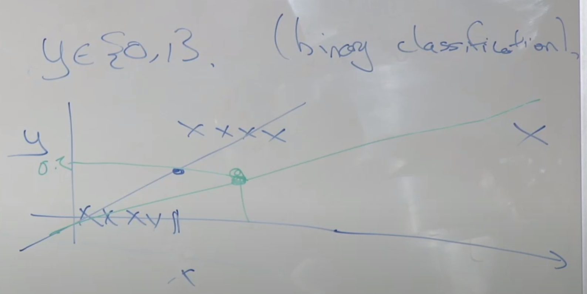

### Logistic Regression

- $$
    h_\theta(x) \in [0,1]; h_\theta(x) = g(\theta^Tx) = \frac{1}{1+e^{-\theta^Tx}}\\
    p(y=1 | x; \theta) = h_\theta(x);\; p(y=0 | x; \theta) = 1 - h_\theta(x); \\
    \text{i.e. } p(y|x;\theta) = h^y_\theta(x)(1-h_\theta(x))^{1-y}\\
    $$

    - Why sigmoid? Will explained at later lectures.
    
- If multi-class classification:
  
    - For each class, using logistic regression to prediction the probability of $x$ to be $y_i$, and using cross-entropy ($-P_{real}logP_{predicted}$).
    
- Using MLE w.r.t. $l(\theta)$.

    - $l(\theta) = \sum\limits_{i=1}^my^ilogh_\theta(x^i) + (1-y^i)log(1-h_\theta(x^i))$
    - Using (Batch) Gradient Ascent to chose $\arg\max\limits_{\theta}l(\theta)$.
        - $\theta_j = \theta_j + \alpha\underbrace{\sum\limits_{i=1}^m(y^i-h_\theta(x^i))x^i_j}_{\frac{\partial(\theta)}{\partial \theta_j}}$ 
        - This is actually **the same as** linear regression.
    - $l(\theta)$ w.r.t our $h_\theta(\cdot)$ will **always be concave**. (no local maximum)

## 3.5. Newton's Method

- Want to maximize $l(\theta)$ == want $l'(\theta) = 0$
- Newton's Method might be an alternative for gradient descent/ascent.
    - It requires much less iteration (fast), but more expensive at each iteration when $\theta$ is high dimensional.
    - 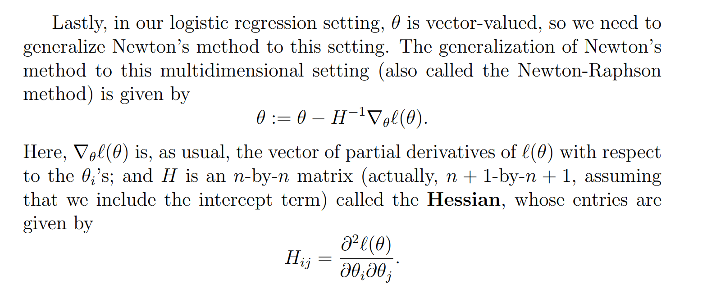
- When parameters are small, do use Newton's Method.

# Lecture 4 - Perceptron & Generalized Linear Model

## 4.1. Perceptron (感知机)

- The perceptron **HARDLY USED IN PRACTICE.**
    - It's kind of arbitrary and intuitive. 

- In binary classification: $h_\theta(x) = g(\theta^Tx)$
    - Logistical regression uses $g(z) = \frac{1}{1+e^{-z}}$, perceptron uses $g(x) = \left\{ \begin{aligned} &1, &z \geq0\\ &0, &z < 0\end{aligned}\right.$
-  $\theta_j = \theta_j + \alpha\underbrace{\sum\limits_{i=1}^m(y^i-h_\theta(x^i))x^i_j}_{\frac{\partial(\theta)}{\partial \theta_j}}$, in perceptron, $(y^i-h_\theta(x^i))$ can be only $\{0, 1, -1\}$.
- 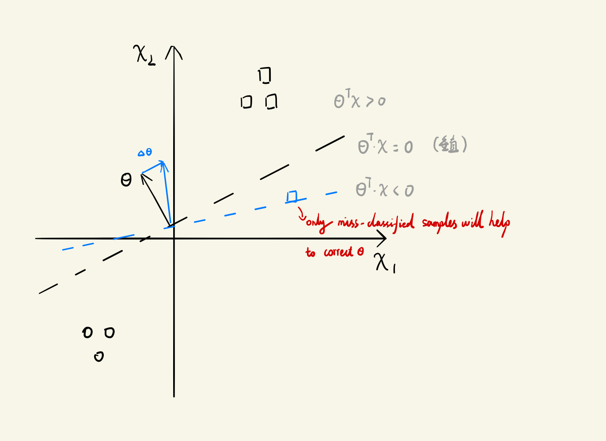
    - So basically, you want $\theta$ to be close to $x$ when $y = 1$ (*this way for all $y = 1$, corresponding $x$ will all be one side of the decision boundary*), and away from $x$ when $y = 0$.

## 4.2. Exponential Family

- Their PDF can be written as $p(y;\eta) = b(y)exp(\eta^TT(y) - a(\eta))$
    - where : $y$ is the **data**; (because in GLM, we actually want to model the output given input)
    - $\eta$ is **natural parameter**; (parameter of the distribution)
    - $T(y)$ is **sufficient statistic** of $y$;
    - $b(y)$ is **base measure**; (scalar)
    - $a(\eta)$ is **log-partition**. (scalar)
    - sufficient statistics: 充分统计量 (对于未知参数的估计问题，保留了原始样本中关于未知参数θ的全部信息的统计量，就是充分统计量); 这里T(y)可以被理解为y
- You can arbitrarily choose $T,b,a$ as long as PDF integrates to 1. 
- E.g. Bernoulli $p(y;\phi) = \phi^y(1-\phi)^{1-y}$
    - $p(y;\phi) = 1\cdot exp[log(\frac{\phi}{1-\phi})y + log(1-\phi)]$
        - $\eta=log(\frac{\phi}{1-\phi}) \rightarrow \phi = \frac{1}{1+e^{-\eta}}; a(\eta) = -log(1-\phi) = -\log(1-\frac{1}{1+e^{-\eta}})$.
- E.g. Gaussian/ Poisson/ Gamma/ Exponential/ Beta/ Dirichlet distribution.
    - see [here](https://people.eecs.berkeley.edu/~jordan/courses/260-spring10/other-readings/chapter8.pdf) (might have proof)
    - In Gaussian $N(\mu, 1)$. $\eta = \mu; a(\eta) = \frac{\mu^2}{2}$

### Properties of exponential family

- MLE w.r.t. $\eta$ is concave. NLL (negative log likelihood) is convex.
- $\mathbb{E[y;\eta]} = \frac{\partial a(\eta)}{\partial \eta}$
- $Var[y;\eta] = \frac{\partial^2 a(\eta)}{\partial^2 \eta}$

## 4.3. Generalized Linear Models (GLM)

- Assumptions / Design choices:
    - $(y|x;\theta) \sim$ Exponential Family $(\eta)$. 
    - $\eta = \theta^Tx; \theta\in\mathbb{R}^n, x\in\mathbb{R}^n$
- How to train / test:
    - Test time: output $\mathbb{E}[y|x;\theta]$, in other words. $h_\theta(x) = \mathbb{E}[y|x;\theta] = \mathbb{E}[y;\eta] = \mathbb{E}[y;\theta^Tx]$.
    - Train time: $\max\limits_\theta logp(y^i|\theta^Tx^i)$

- 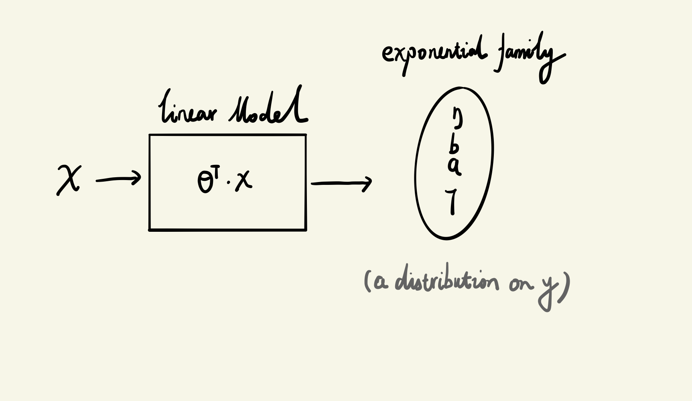
- **Learning update rule**: (the same as linear regression / logistic regression)
    - $\theta_j = \theta_j + \alpha\sum\limits_{i=1}^m(y^i-h_\theta(x^i))x^i_j$ 
- Terminologies:
    - $\eta$ is natural parameter
        - $ g(\eta) \triangleq \mathbb{E}[y;\eta]$ is called canonical response function (正则响应函数)
        - and $\mathbb{E[y;\eta]} = \frac{\partial a(\eta)}{\partial \eta}$ for exponential families.
    - $\eta = g^{-1}(\mathbb{E}[y;\eta])$ is called canonical link function. (正则关联函数)
- 3-parameterization spaces: 
    - model parameter: $\theta$;
    - natural parameter $\eta$;
    - canonical parameter: $\phi$ for Bernoulli; $(\mu, \sigma)$ for Gaussian; $\lambda$ for Poisson.
    - where in GLM, $\eta = \theta^Tx$ is our **design choice**, $g$ is the link between $\eta$ and canonical parameters.
        - $g(\eta) = \mathbb{E}[y;\eta] = ...$, and $\mathbb{E}[y;\eta] = f(\text{canonical})$.
        - More intuitively, $\eta$ and $\text{canonical}$ are just parameters of your distribution, so if you write the distribution pdf as the form of exponential family, you can directly get the relationship between $\eta$ and $\text{canonical}$s.
            - e.g. In Bernoulli, $\phi = \frac{1}{1+e^{-\eta}}$.

### What is GLM doing:

- Actually in linear regression, you **actually assume** the response $(y|x;\theta)$ is Gaussian, while this is quite limited.
    - 
    - see [here](https://towardsdatascience.com/generalized-linear-models-9cbf848bb8ab) (How to **choose distribution fit to your data**)
- For $(y|x;\theta)$, you **can choose** a distribution that you want $(y|x;\theta)$ to following (exponential family), then you can automatically get a GLM and start training.
- I.E. If you want to $(y|x;\theta) \sim $ Bernoulli $\phi$:
    - In Bernoulli $\phi = \frac{1}{1+e^{-\eta}}$.
    - then you get $h_\theta(x) = \mathbb{E}[y;\eta] = \mathbb{E}[y|x; \theta] = \phi$ (The expectation of Bernoulli is $\phi$).
    - then you get $h_\theta(x) = \phi = \frac{1}{1+e^{-\eta}} = \frac{1}{1+e^{-\theta^Tx}}$. (where $\eta = \theta^Tx$ is your **design choice**.)

## 4.4. Softmax Regression (Multi-class Classification)

- $k$ classes, $y$ is a one-hot vector $\in\mathbb{R}^k$, and $x\in\mathbb{R}^n$, so $\theta \in \mathbb{R}^{n\times k}$.
    - It's like doing linear regression to predict the probability of $x$ to be each class. (after Softmax)
        - $\begin{bmatrix}\theta^1x\\ \vdots\\\theta^kx\\ \end{bmatrix} = \begin{bmatrix}p(x\in\text{class}^1)\\\vdots\\ p(x\in\text{class}^k)\end{bmatrix}$
    - Then do linear regression with cross-entropy.

## 4.5. TODO 复习泊松之类的分布

# Lecture 5 - GDA & Naive Bayes

- Previous methods are all **discriminative learning algorithms**, today we are going to talk about **generative learning algorithms**. (GDA)
    - A discriminative model learns $p(y|x)$; or $ h_\theta = \left\{\begin{aligned}0\\1\end{aligned} \right.$ directly.
    - A generative learning algorithm learns $p(x|y)$ and $\underbrace{p(y)}_{\text{class prior}}$.
        - Bayes rule: $p(y = 1| x) = \frac{p(x | y = 1)p(y = 1)}{p(x)} = \frac{p(x | y = 1)p(y = 1)}{\sum\limits_{y_0\in Y}p(x,y=y_0)} = \frac{p(x | y = 1)p(y = 1)}{\sum\limits_{y_0\in Y}p(x|y)p(y_0)} $

## 5.1. Gaussian Discriminant Analysis (GDA)

- Suppose $x \in \mathbb{R}^n$ (drop $x_0 = 1$ convention in lecture 2), assume $p(x|y)$ is **Gaussian**.
- Multi-variable $z \sim \mathbb{R}^n, z\sim N(\mu, \Sigma)$, $Cov(z) = E((z-\mu)(z-\mu)^T) = E(zz^T) - E(z)E^T(z)$, $p(z) = \frac{1}{(2\pi)^{\frac{n}{2}}|\Sigma|^{\frac{1}{2}}}exp(-\frac{1}{2}(z-\mu)^T\Sigma^{-1}(z-\mu))$.
    - 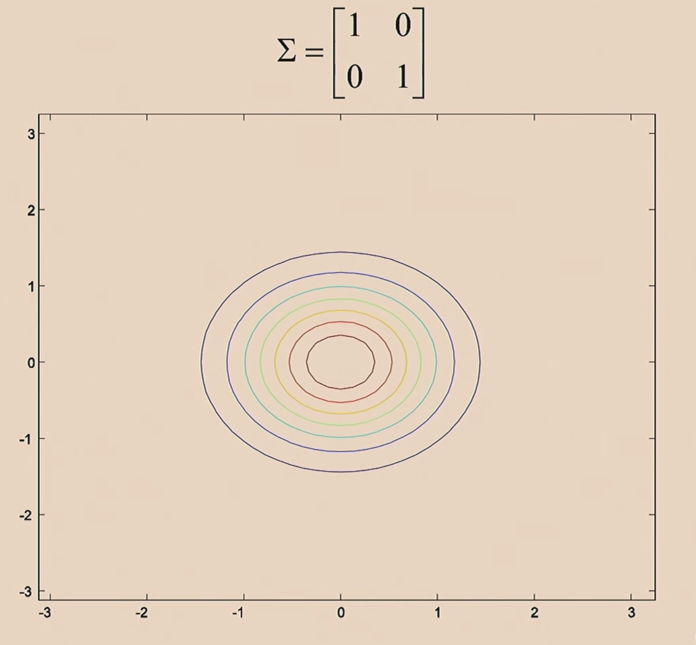 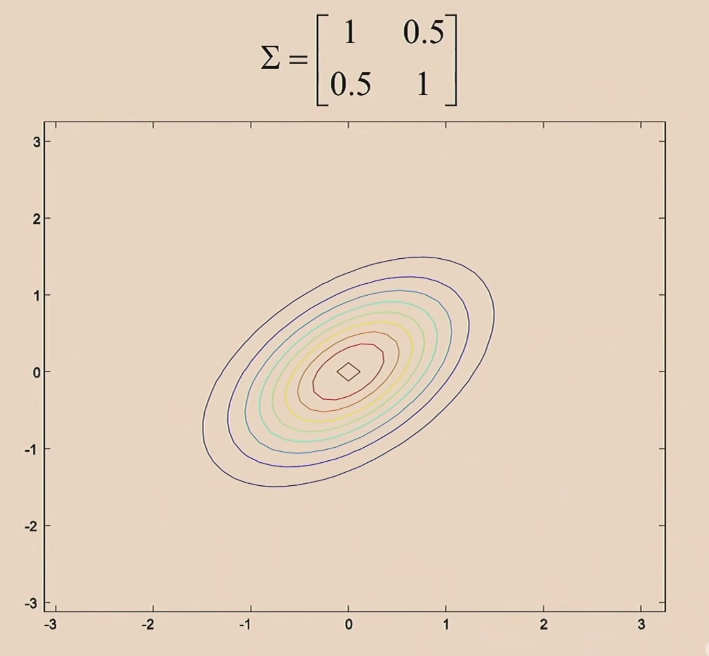

### 5.1.1. GDA model

- **Gaussian Discriminant Analysis is an example of Generative Learning Algorithms.**
  
- Assume model is Gaussian, i.e. $p(x|y)$ is Gaussian. (Let's use binary classification as an example.)
  
    - Assume $\Sigma_1 == \Sigma_2 == \Sigma$
        - **By doing so, the decision boundary is linear.**
    - Parameters: $\mu_0, \mu_1, \Sigma, \phi$
    
- $p(x|y = 0) =\frac{1}{(2\pi)^{\frac{n}{2}}|\Sigma|^{\frac{1}{2}}}exp(-\frac{1}{2}(x-\mu_0)^T\Sigma^{-1}(x-\mu_0))$, $p(x|y = 1) =\frac{1}{(2\pi)^{\frac{n}{2}}|\Sigma|^{\frac{1}{2}}}exp(-\frac{1}{2}(x-\mu_1)^T\Sigma^{-1}(x-\mu_1))$,   

    $p(y) = \phi^y(1-\phi)^{1-y}$.

- How to fit the parameters? --> Maximize the joint likelihood.
    - $L(\phi, \mu_0, \mu_1, \Sigma) = \mathop\Pi\limits_{i=1}^m\underbrace{p(x^i,y^i;\phi, \mu_0, \mu_1, \Sigma)}_{\text{joint}}$. ($p(X|Y)p(Y)$)
        - While in discriminative models: $L(\theta) = \mathop\Pi\limits_{i=1}^m\underbrace{p(y^i|x^i;\theta)}_{\text{conditional}}$.
    
- Using MLE to $log(L(\phi, \mu_0, \mu_1, \Sigma))$:
  
    - $\phi=\frac{\sum\limits_{i=1}^m I(y^i=1)}{m}$, $\mu_t = \frac{\sum\limits_{i=1}^m I(y^i=t)x^i}{\sum\limits_{i=1}^m I(y^i=t)}$, $\Sigma = \frac{1}{m}\sum\limits_{i=1}^m(x^i-\mu_{y^i})(x^i-\mu_{y^i})^T$.
    
- Using GDA to predict:
  
    - $\max\limits_yp(y|x) = \arg\max\limits_{y}\frac{p(x|y)p(y)}{p(x)}$; while $p(x)$ is **constant** w.r.t. $y$. (normalizer)

### 5.1.2. GDA vs logistic regression:

- GDA: $p(y=1|x; \phi, \mu_0, \mu_1, \Sigma) = \frac{p(x|y=1;\mu_1, \Sigma)p(y=1;\phi)}{p(x;\phi,\mu_0,\mu_1,\phi)}$.
    - 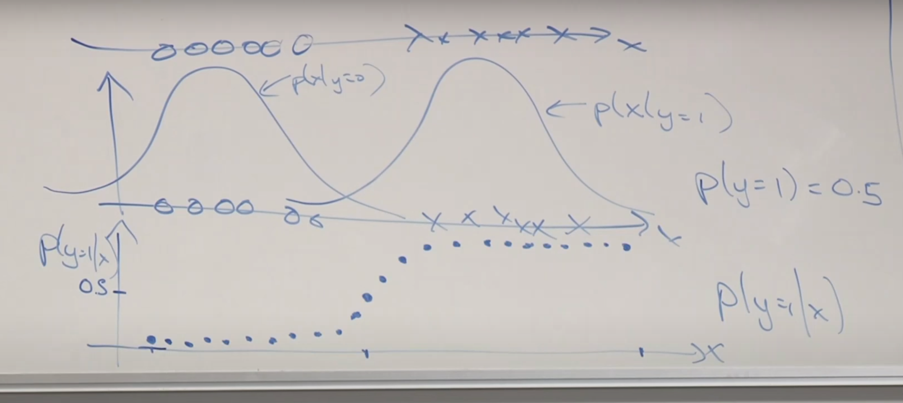
    - Actually a  **sigmoid** function.

## 5.2. Generative vs Discriminative

- Generative vs Discriminative ([link](https://medium.com/@mlengineer/generative-and-discriminative-models-af5637a66a3#:~:text=In%20General%2C%20A%20Discriminative%20model,P(Animal%20%7C%20Features).&text=A%20Generative%20Model%20%E2%80%8Clearns%20the,p(x%2Cy).))
  
    > In General, A Discriminative model ‌models the **decision boundary between the classes**. A Generative Model ‌explicitly models the **actual distribution of each class**. 
    >
    > 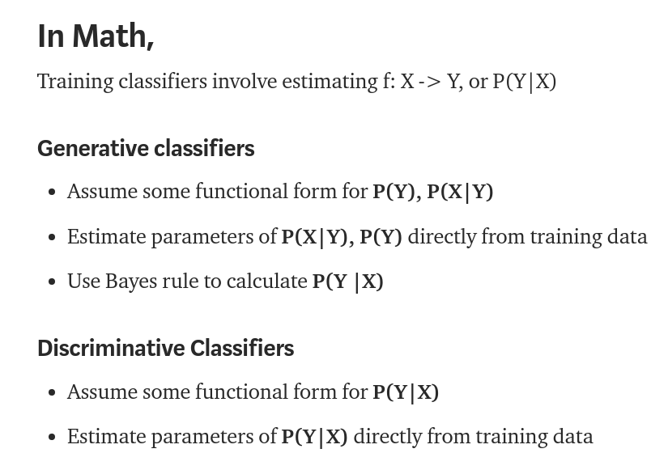
    
- GDA's Assumption: (1)
  
    - $x|y=0\sim N(\mu_0,\Sigma)$
    - $x|y=1\sim N(\mu_1,\Sigma)$
    - $y\sim \text{Bernoulli}(\phi)$
    
- Logistic regression's Assumption: (2)
  
    - $p(y=1|x) = \frac{1}{1+e^{-\theta^Tx}}$.
    
- $(1)\rightarrow(2)$; $(2)\nrightarrow(1)$:
    - GDA is actually making a **much stronger assumptions**.
    - So if this stronger assumption *is **roughly correct***, then GDA will probably do better. (especially when the data set is small.)
    
- $\left.\begin{aligned}x|y = 0 &\sim \text{Possion}(\lambda_0)\\x|y = 1 &\sim \text{Possion}(\lambda_1)\\y &\sim \text{Bernoulli}(\phi)\end{aligned} \right\} \rightarrow p(y=1|x)\text{ is logistic}.$
  
    -   If $x|y=i$ comes from the same exponential distribution family (only varies in natural parameters), then $p(y=i|x)$ will be in the form of logistic.

## 5.3. Naive Bayes (part 1)

- *The email spam problem.* (Naive Bayes is a **generative method**.)
- Feature vector $x$ (bag of words) $\{0,1\}^n$, $y\in \{0,1\}$:
    - If we want to model $x$ (has $2^n$ possible values) with a multinomial distribution, we will need $2^n-1$ parameters. (*-1* because probability adds up to 1.)
    - Note: $x|y$ might not following the Gaussian distribution.
- **Naive Bayes Assumption**:
    - $x_i$ is conditionally independent given $y$.
    - $p(x_1, \cdots, x_n | y) = p(x_1|y)p(x_2|y, x_1)\cdots p(x_n|y, x_1, x_2, \cdots, x_{n-1}) \triangleq p(x_1|y)p(x_2|y)\cdots p(x_n|y)$.
- $\begin{aligned}\phi_{j|y_0} &= p(x_j=1|y=y_0) \\ \phi_y &= p(y=1) \end{aligned}$.
- Using MLE to maximize joint likelihood $p(x,y;\phi_y,\phi_{j|y})$
    - $\phi_y=\frac{\sum\limits_{i=1}^m I(y^i=1)}{m}$, $\phi_{j|y=1} = \frac{\sum\limits_{i=1}^m I(x^i_j=1, y^i=1))}{\sum\limits_{i=1}^m I(y^i=1)}$.
    - Problem might happen when the denominator is zero.
    - $p(y=y_0 | x) = \frac{p(x|y=y_0)p(y=y_0)}{p(x)} = \frac{p(x|y=y_0)p(y=y_0)}{p(x|y=0)p(y=0)+p(x|y=1)p(y=1)} $

# Lecture 6 - Support Vector Machines

## 6.1. Naive Bayes (part 2)

- *problem*: if *word* j never appears in your training set, then $p(x_j=1|y=y_0)$ will always be zero.
  -  And this will make $p(x^i|y=y_0)$ to always be zero.
  - Note: $x^i_j$ is word *j* of the *i* th sample. 

### 6.1.1. Laplace Smoothing

- Assume adding **one example** to each class.
- $\phi_y=\frac{\sum\limits_{i=1}^m I(y^i=1) + 1}{m+2}$, $\phi_{j|y=1} = \frac{\sum\limits_{i=1}^m I(x^i_j=1, y^i=1) + 1}{\sum\limits_{i=1}^m I(y^i=1) + 2}$.

### 6.1.2. Event Models for Text Classification

- New representation: for a letter with $n_i$ words: $x_i \in \mathbb{R}^{n_i}$, each dimension stands for a word appearing in the letter. (Multinomial event model)
- $p(x,y) = p(x|y)p(y)\overbrace{=}^{\text{assume}} \mathop\Pi\limits_{j=1}^np(x_j|y)p(y) $, and we assume $p(x_j=k|y=y_0) \triangleq \phi_{k|y=y_0}$, which means that we assume the probability of word $j$ to appear at any position is equal.
- Using MLE to joint likelihood $p(x,y)$:
  - $\phi_{k|y=y_0} = \frac{\sum\limits_{i=1}^m[I(y^i=y_0)\sum\limits_{j=1}^{n_i}I(x_j^i=k)]}{\sum\limits_{i=1}^mI(y^i=y_0)\cdot n_i}$ (Laplace: $\phi_{k|y=y_0} = \frac{\sum\limits_{i=1}^m[I(y^i=y_0)\sum\limits_{j=1}^{n_i}I(x_j^i=k)] + 1}{\sum\limits_{i=1}^mI(y^i=y_0)\cdot n_i  + sizeof\text{(bag of words)}}$)
  - $\phi_{y=y_0}=\frac{\sum\limits_{i=1}^m I(y^i=y_0)}{m}$
- One way to deal with *unknow words*: map them to a special token (*UNK*).

## 6.2. Comments on Apply ML

- If you are not aiming to create a new algorithm, the base rule is to implement something **quick and dirty** (e.g. Naive Bayes) rather than complete and complex. And using analysis for better understanding.
- When you start to work on a project, it's hard to know what's the most difficult and worth studying part of the project.

## 6.3. SVM Introduction

- *Logistical regression* or *GDA* will have **linear decision boundary**. 
  - You can map feature vectors to a higher dimensional space, and then linear classifier (like logistical regression, but different in detail) can indeed learn non-linear regression.

### 6.3.1. **Optimal margin classifier (separable cases)**

- Notation: 
  - Labels $y\in\{-1,1\}$. Have $h$ output values in $\{-1,1\}$.
  - $g(x) = \left\{\begin{aligned}1, \text{if }z \geq 0 \\ -1 , \text{otherwise}\end{aligned}\right.$
  - $h_{w,b} = g(w^T+b)$, where $w\in\mathbb{R}^n, b\in\mathbb{R}$.
  
- **Functional margin**: how confidently and accurately do you classify an example.
  
  - Functional margin of hyperplane defined by $(w,b)$ w.r.t. $(x^i,y^i)$: 
    - $\hat\gamma^i = y^i\cdot(w^Tx^i+b)$, and $\left \{\begin{aligned}\text{if }y^i = 1, \text{want } w^Tx^i+b >> 0 \\ \text{if }y^i = -1, \text{want } w^Tx^i+b << 0\end{aligned} \right .$
    - if $\hat\gamma^i > 0$, that means $h(x^i)=y^i$. (correctly classified)
  - Functional margin w.r.t. the **training set**:
    - $\hat\gamma=\min\limits_{i}\hat\gamma^i$ (we assume it's separable cases.)
  - It's easy to cheat to increase functional margin (e.g. multiply $w,b$ by $10$).
    - Counteraction: $(w,b) \rightarrow (\frac{w}{||w||}, \frac{b}{||b||})$.
  
- **Geometric margin**: the minimal distance between examples and decision boundary.

  - Geometric margin of hyperplane defined by $(w,b)$ w.r.t. $(x^i,y^i)$:
    - $\gamma^i = \frac{w^Tx^i + b}{||w||}$ . (further defined as $\frac{y^i(w^Tx^i + b)}{||w||} = \frac{\hat{\gamma}^i}{||w||}$ if we have positive and negative data)
  -  Geometric margin w.r.t. the **training set**:
    - $\gamma=\min\limits_{i}\gamma^i$
  
- Optimal margin classifier: choose $(w,b)$ to maximize $\gamma$.

- $$
  \text{To find } \max\limits_{w,b,\gamma} \gamma\\
    s.t.\,{y^i(w^Tx^i + b)} \geq \gamma,\, i= 1, \cdots, m\\
    ||w|| = 1
  $$

- $||w|| = 1$ is a nasty assumption (non-convex), so we would like to reformalize it to a nicer one.

  - $$
    \text{To find } \max\limits_{w,b,\hat\gamma} \frac{\hat\gamma}{||w||}\\
        s.t.\,{y^i(w^Tx^i + b)} \geq \hat\gamma,\, i= 1, \cdots, m
    $$

  - We want to maximize the geometric margin $\frac{\hat\gamma}{||w||}$ subject to functional margins all being at least $\hat\gamma$ . But still, $\frac{\hat\gamma}{||w||}$ is non-convex.

- Can be re-formalized as: (choose $\hat\gamma = 1$, for that we can arbitrarily rescale functional margin)

  - $$
    \text{To find } \min\limits_{w,b} \frac{1}{2}||w||\\
            s.t.\,{y^i(w^Tx^i + b)} \geq 1,\, i= 1, \cdots, m
    $$

  - This is a problem with **convex quadratic objective** and **only linear constraints**.

### 6.3.2. Kernels (Lecture 07)

- **Representor theorem**: the optimal $w$ is linear combination of $x^i$ (for math simplicity we add $y^i$)
  - $w = \sum\limits_{i=1}^m\alpha_iy^ix^i$  (NOTE: $\alpha_i$ here is $\alpha$ in Lagrangian function)
    - Intuition #1: as you run linear regression, $w$ will always be the linear combination of training examples $x^i$.
    - Intuition #2: $w$ is perpendicular to the decision boundary, so it can be interpreted as combination of each training example $x^i$.
    
  - Optimal margin classifier can be thus wrote as:
  
    - $$
      \min\frac{1}{2}\sum\limits_{i}\sum\limits_{j}\alpha_i\alpha_jy^iy^j<x^i,x^j>\\
      s.t.\,y^i(\sum\limits_{j}\alpha_jy^j<x^j,x^i>+b) \geq 1,\,i= 1, \cdots, m
      $$
- Further simplify the optimization problem: ("Dual optimization problem")

  - $$
    \max\sum\limits_i\alpha_i-\frac{1}{2}\sum\limits_i\sum\limits_jy^iy^j\alpha_i\alpha_j<x^i,x^j>\\
    s.t.\, \alpha_i\geq0,\,\sum\limits_iy^i\alpha_i=0,\,i= 1, \cdots, m
    $$
    

- To make a prediction: $h_{w,b}(x)=g(w^Tx+b)=g((\sum\limits_i\alpha_iy^ix^i)^Tx+b)=g(\sum\limits_{i}\alpha^iy^i<x^i,x>+b)$

- **Kernel trick**:

1. Write algorithm in terms of $<x^i,x^j>$ (or $<x,z>$).
2. Let there be mapping from $x\rightarrow\underbrace{\phi(x)}_{\text{high dimensional}}$.
3. Find way to compute $k(x,z)=\phi^T(x)\phi(z)$.
4. Replace $<x,z>$ in algorithm with $k(x,z)$. 

- **SVM = Optimal margin classifier + Kernel tricks**
  - Linear decision boundary in high dimensional space can be projected as a non-linear decision boundary in low dimensional space.
- **How to make kernels?**
  - One idea that $k(\cdot,\cdot)$ try to hold: if $(x,z)$ are "similar" / "dissimilar", $k(x,z)$ is "large" / "small". (相似的向量内积较大)
  - Does that exist $\phi$ such that $k(x,z)=\phi^T(x)\phi(z)$? (e.g. $k(x,x)=\phi^T(x)\phi(x)\geq0$)
  - Let $\{x^1,\cdots, x^d\}$ be points, let "kernel matrix" $k\in\mathbb{R}^{d\times d}$, where $k_{ij}=k(x^i,x^j)$.
    - We can prove $k$ is positive semidefinite.
    - 
- Gaussian kernel: $k(x,z)=e^{-\frac{||x-z||^2}{2\sigma^2}}$ (corresponding to $\phi(x)\in\mathbb{R}^{\infty}$); Linear kernel $k(x,z)= x^Tz$. 

### 6.3.3. Inseparable cases and regularization

- We can not always guarantee to find a clear separating  hyperplane (even with kernel tricks), and sometimes *finding a separating hyperplane is not exactly what we want*, for that it might be susceptible to outliers.
  
- 
  
- **L1-norm** soft margin SVM:

  - $$
    \min\limits_{w,b,\xi_i} \frac{1}{2}||w||^2 + C\sum\limits_{i=1}^m\xi_i\\
    s.t.\, y^i(w^Tx^i+b) \geq 1 - \xi_i,\,i = 1\cdots m\\
    \xi_i\geq0,\,i = 1\cdots m
    $$
    
  - $C$ is balancing between *making $||w||^2$ small (margin large)* and *ensuring that most examples have functional margin at least 1*.
  
- Also :

  - $$
    \max\sum\limits_i\alpha_i-\frac{1}{2}\sum\limits_i\sum\limits_jy^iy^j\alpha_i\alpha_j<x^i,x^j>\\
        s.t.\, 0\leq\alpha_i\leq C,\,i = 1\cdots m\\
        \sum\limits_iy^i\alpha_i=0
    $$

- 

### 6.3.4. How to solve the problem

- TODO: **SMO**.

# Lecture 8 - Data Splits, Models & Cross-Validation

## 8.1. Bias / Variance

- Complex model (high degree polynomial) tends to "overfit", which means it greatly depends on the data you get, which means they have relatively high variance. 

## 8.2. Regularization

- Why SVM won't overfitting? (as it can work in highly dimensional space) -> it minimize $||w||$.
-  In regularization, we have $\lambda||\theta||^2$, which means $\lambda$ has the same scale for every feature, so you need to **normalize** every dimension.
- Bayesian interpretation of regularization: **the prior is Gaussian**
  - $\arg\max_\theta P(\theta|Data) = \arg\max_\theta\frac{P(Data|\theta)P(\theta)}{P(Data)} = \arg\max_\theta P(Data|\theta)P(\theta) = \arg\max_\theta\underbrace{\mathop\Pi\limits_{i=1}^mp(y^i|x^i,\theta)}_{\text{for GLM}}P(\theta)$
  - If you assume $\theta\sim N(0,\Sigma)$, you can deduct the same regularization techniques we use.

### 8.2.1. Two major academic school of statistics:

- Frequentist interpretation: $\arg\max_\theta P(Data|\theta)$; (MLE)
  - There exists *constant-valued but unknown* parameters, and we want to estimate the most likely ones.
- Bayesian interpretation:  prior and posterior $\arg\max_\theta P(\theta|Data)$; (MAE: maximum a posteriori)
  - Parameter $\theta$ is a *random variable* whose value is known. (Note that $\theta$ is a random variable, it's ok to condition on its value and write "$p(y|x,\theta)$" instead of "$p(y|x;\theta)$").
  - $\begin{aligned}p(\theta|Data) = & \frac{p(Data|\theta)p(\theta)}{p(Data)}\\= & \frac{(\mathop\Pi\limits_{i=1}^mp(y^i|x^i,\theta))p(\theta)}{\int_\theta(\mathop\Pi\limits_{i=1}^mp(y^i|x^i,\theta)p(\theta))d\theta}\end{aligned}$.
  - When doing prediction: $\begin{aligned}p(y|x,Data)=\int_\theta p(y|x,\theta)p(\theta|Data)d\theta\\E[y|x,Data]=\int_yyp(y|x,Data)dy\end{aligned}$.
    - But in general it's very difficult to compute the posterior distribution $p(\theta|Data)$, so instead we often replace the posterior distribution with $\theta_{MAE} = \arg\max_\theta P(\theta|Data) = \arg\max_\theta (\mathop\Pi\limits_{i=1}^mp(y^i|x^i,\theta))p(\theta)$

## 8.3. Train / dev / test splits

- （Simple) Hold-out cross validation: Train your model on $T_{train}$ and pick the one with lowest error on $T_{dev}$. Finally report your score on $T_{test}$.
- You **should not** make any decision based on $T_{test}$, otherwise $T_{test}$ won't be an un-biased estimation.

## 8.4. Model selection & Cross validation

- K-fold cross validation:
  - When the size of your data set is **rather small**, then if you can't use $T_{test}$, you seems to waste a substantial amount of data. 
  - Separate your data into $k$ folders, and loop **$k$ times** (this is very expensive unless your data set is small), for each time $i$ train a model on other $k-1$ folders and test on folder $i$. Finally you *average* your error. (You have $k$ models in the end)
  - Then you can find the optimal model (*e.g. best polynomial*) and train it on all data.
- Leave-one cross validation:
  - k = m (the number of your training samples.)
- Feature selection:
  - Feature set $\mathcal{F}=\phi$：
  - Loop:
    - Try adding each remaining feature $i$, and see how this feature help improve your performance.
    - Add the best feature $i$ into $\mathcal{F}$.

# Lecture 9 - Approx/Estimation Error & ERM

## 9.1. Setup / Assumptions

- Data distribution $(x,y)\sim D$, including training and testing.
- Samples are i.i.d.
  - Data (random variable) $\rightarrow$ learning algo (deterministic) $\rightarrow$ hypothesis $\hat{h}$ / $\hat{\theta}$ (random variable)

## 9.2. Bias / Variance

- From the `data view` and `parameter view`
  -  

> - if $Var[\hat{\theta}]\rightarrow0$ as $m\rightarrow\infty$: "statistical efficiency"
> - $\hat{\theta}\rightarrow\theta^*$: "consistent"
> - $\mathbb{E}[\hat{\theta}]=\theta^*$: "unbiased"

## 9.3. Approx Estimation

- $g$ is the best hypothesis, $h^*$ is the best hypothesis in your hypothesis set $\mathcal{H}$.
- Risk / Generalization error: $\epsilon(h)=\mathbb{E}_{(x,y)\sim D}[I(h(x)\neq y)]$
- Empirical risk: $\hat{\epsilon}_{S}(h) = \frac{1}{m}\sum\limits_{i=1}^mI(h(x^i)\neq y^i)$, $S$ is the data set. ($\hat{}$ means with finite data set.)
- Bayes error / Irreducible error: $\epsilon(g)$.
- Approximation error: $\epsilon(h^*)-\epsilon(g)$
- Estimation error: $\epsilon(\hat{h})-\epsilon(h^*)$.
  - 

## 9.4. Empirical Risk Minimization (ERM)

- $\hat{h}_{ERM} = \arg\min\limits_{h\in\mathcal{H}}\hat{\epsilon}(h) = \arg\min\limits_{h\in\mathcal{H}}\frac{1}{m}\sum\limits_{i=1}^m I(h(x^i)\neq y^i)$.

## 9.5. The case of finite $\mathcal{H}$

- Tools:
  - `Union Bound`: with events `A1, A2, ..., Ak` (need not to be independent):
    - $P(A_1\cup A_2 \cup \cdots \cup A_k)\leq \sum\limits_{i=1}^kP(A_i)$.
  - `Hoeffding's Inequality`: Let $Z_1, Z_2, \cdots, Z_m\sim Bernoulli(\phi)$ ($Z$ is bounded), and $\hat{\phi} = \frac{1}{m}\sum\limits_{i=1}^mZ_i$:
    - $P[\underbrace{|\hat{\phi}-\phi|}_{error}>\underbrace{\gamma}_{margin}]\leq2e^{-2\gamma^2m}$, where $r>0$.
- Training error $\hat{\epsilon(h)}$ is a reliable estimate of $\epsilon(h)$ for all h:
  - For $h_i\in\mathcal{H}$, consider a Bernoulli random variable $Z = I(h_i(x)\neq y)$, and $Z_j=I(h_i(x^j)\neq y^j)$. We can see that $\hat{\epsilon}(h_i)=\frac{1}{m}\sum\limits_{j=1}^m Z_j$, which means $\hat{\epsilon}(h_i)$ is exactly the mean of $m$ random variables $Z_j$ that are drawn i.i.d. from a Bernoulli distribution with mean $\epsilon(h_i)$.
  - With `Hoeffding's Inequality`: $P(|\epsilon(h_i)-\hat{\epsilon}(h_i)|>\gamma)\leq2e^{(-2\gamma^2m)}$.
    - This can be true simultaneously for all $h\in\mathcal{H}$. Let $A_i$ denote the event that $|\epsilon(h_i)-\hat{\epsilon}(h_i)|>\gamma$, then $P(A_i)\leq2e^{(-2\gamma^2m)}$, with `Union Bound` we can prove that:
    - 
    - i.e. $P(\forall h\in\mathcal{H} |\,|\epsilon(h)-\hat{\epsilon}(h)|>\gamma) \geq 1 - 2ke^{-2\gamma^2m}$, this is called a *uniform convergence result*.
- Sample complexity: **how many samples** does one algorithm require to achieve a certain level of performance with certain confidence.
- If *uniform convergence* holds, we can prove that the generalization error $\hat{h}$ is at most $2\gamma$ worse than the best possible hypothesis in $\mathcal{H}$:
  - 
  - We can formally write it as: 
    - 
    - i.e. 

## 9.6. The case of infinite $\mathcal{H}$

- How to define the *number of parameters* in $\mathcal{H}$?
  - $h_\theta(x)= I(\theta_0+\theta x_1+\cdots+\theta_n x_n\geq0)$ is the same as $h_{u,v}(x)=I((u_0^2-v_0^2)+(u_1^2-v_1^2)x_1+\cdots+(u_n^2+v_n^2)x_n\geq0)$
- `VC-dimension`:
  - 
  - Note: **shatter** means **any arbitrary labeling**!
    - And consider $h_\theta(x)=I(\theta_0+\theta_1x_1+\theta_2x_2\geq0)$, even if there is some set with size $3$ that $h$ can not shatter: , but as long as there is some set with size $3$ that $h$ can shatter: , then $VC(h)=3$.
- Then we can roughly prove that for $REM$ method, in order to learn "well" using a hypothesis class with $d$ VC-dimension, generally the number of training examples we need is going to be linear in $d$. 
  - 
  - 

- Informally the VC dimension (assuming a “reasonable” parameterization) is also roughly linear in the number of parameters.

# Lecture 10 - Decision Trees and Ensemble Methods

## 10.1. Decision Trees

- 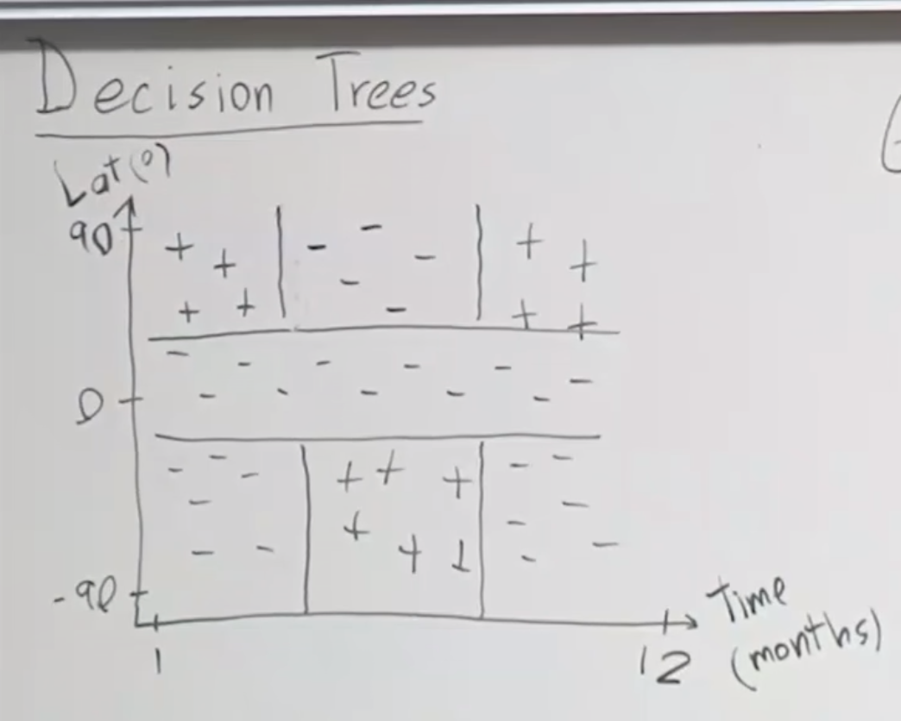
  - We accomplish this by petitioning the input space $X$ into disjoint subsets (or **regions**) $R_i$. (non-linear)
- How to selecting $Regions$:
  - **Top-down**, leaf node (feature dimension), threshold, greedy.
  - Loss function:
    - Given parent region $R_p$ and child region $R_1$ and $R_2$, we want to maximize the *decrease* of loss: $L(R_p)-\frac{|R_1|L(R_1)+|R_2|L(R_2)}{|R_1|+|R_2|}$.
    - And the loss of one region has multiple choices:
      - Misclassification loss:  $L_{misclass}(R)=1-\max\limits_c(\hat{p}_c)$, which is the number of examples that would be misclassified if we predicted the majority class for region $R$. 
        - Let $\hat{p}_c$ denote the proportion of examples in $R$ that are of class $c$).
      - Cross-entropy Loss: $L_{cross}(R)=-\sum\limits_{c}\hat{p}_clog_2\hat{p}_c$. (Strictly concave).
      - Squared loss: $L_{squared}(R)=\frac{\sum\limits_{i\in R}(y_i-\hat{y})^2}{|R|}$.
        - If we use the mean of the region $R$ for prediction.
- Other Considerations:
  - Categorical Variables: If we have a feature with possible candidates from $S$ (e.g. $\{Y,N\}$), then one way to choose threshold is to have $2^{|S|}$ leaf nodes.
  - Regularization: only stop until each leaf region contains exactly one training data / the same label. (**the feature can be reused (not KD-tree)**)
    - 
- Runtime complexity: $n$ examples, $f$ features, depth $d$:
  - Testing: $O(d)$.
  - Training: Each example will belong to $O(d)$ nodes, and the complexity for each node is $f$, so the total time cost is $O(ndf)$,
    - Belong to $O(d)$ nodes: at each level of the tree, the data point will only **belong to** one subregion.
- Lack of additive structures:
  -  

## 10.2. Ensemble Methods

> Note: ensemble (集成) != embedding (嵌入).

- Given i.d. (not independent, correlation $\rho$) random variable $X_i$'s:
  - $\begin{aligned}Var(\bar{X}) &= Var(\frac{1}{n}\sum\limits_iX_i)\\&=\frac{1}{n^2}\sum\limits_{i,j}Cov(X_i,X_j)\\&=\rho\sigma^2+\frac{1-\rho}{n}\sigma^2\end{aligned}$ , where we use Pearson correlation coefficient that $\rho_{X,Y}=\frac{Cov(X,Y)}{\sigma_x\sigma_y}$.
  - We can consider each random variable to be the error of a given **model**:
    - So we want to 1. increase the number of models used ($n$).  2. decrease the correlation between models.
    - Ways to do so: 
      - Using different algorithms and different training sets.
      - Bagging: variance reduction.
      - Boosting: bias reduction.

## 10.3. Bagging (Random Forests)

- Bagging = Bootstrap + Aggregation
- Bootstrap: a method from statistics traditionally used to measure uncertainty of some estimator (e.g. mean).
  - True population $P$ we want to estimate, sample $S\sim P$, due to time constraints, we might not be able to sample sufficient training sets $S_1,\cdots, S_m$.
  - Instead, if we assume $S=P$, we can generate bootstrap sample $Z\sim S$, which can be as many as we want $Z_1,\cdots,Z_m$.
- Aggregation: train a model $G_m$ on every bootstrap sample $Z_m$, and an aggregation estimator $G(X)  = \sum\limits_m\frac{G_m(x)}{M}$.
- Remember $Var(\bar{X}) = \rho\sigma^2+\frac{1-\rho}{M}\sigma^2$:
  - Bagging decrease $\rho$ compared to simply training on $S$. while increasing bias for that each bootstrap set does not having the full training set available.
  - Also note that increasing the number of predictors $M$ can’t lead to additional overfitting, as $\rho$ is insensitive to $M￥ and therefore overall variance can only decrease.
- **out-of-bag estimation**: 
  - 

- Random-forest:
  - Decision tree is a high-variance and low-bias model, so it's natural we apply bagging to it, but one downside is that we might lose the interpretability (through there are other methods like *variable importance measure*).
  - If there is one strong feature, it might occur at every tree, which lead to higher correlation. Therefore,  we instead only allow a subset of features to be used at each split. (lower variance and higher bias)

## 10.4. Boosting (Addboost, xgboost)

# Lecture 14 - Expectation-Maximization Algorithms

## 14.1 K-means

$$
\mathcal{D}: \{x^1, \cdots, x^N\}\\
\text{Initialize cluster centrals: randomly select k samples from your dataset.}\\
\text{Clustering each data according to: } c^i = \arg\min\limits_{j=1:k}||x^i-\mu_j||_2\\
\text{Calculate the mean for each cluster: } \mu_j = \frac{\sum\limits_{i=1:N}I(c^i=j)x^i}{\sum\limits_{i=1:N}I(c^i=j)}
$$

- The initialization should make sure that each cluster center is non-empty for the first clustering.
- The cost function $L(c,\mu) = \sum\limits_{i=1:N}||x^i-\mu_{c^i}||_2$, k-means will drag this cost function down.
  - K-means will stick at local minimal, so you should run that multiple times with random initialization.

## 14.2 Mixture Gaussian

- Anomaly detection: model $p(x)$, then if $p(x) \leq \delta$, chances are that it's anomaly.
- 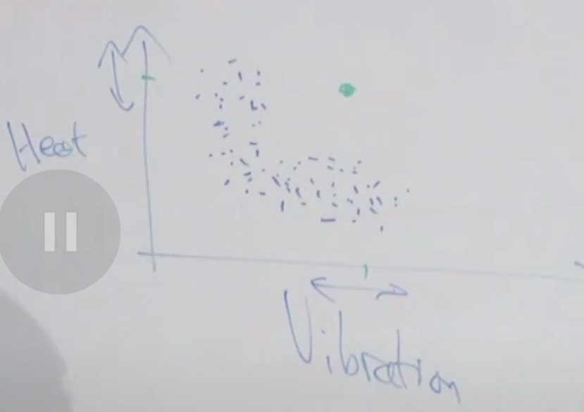
  - How to model an 'L' distribution? --> GMM.

- 1-D example:
  - 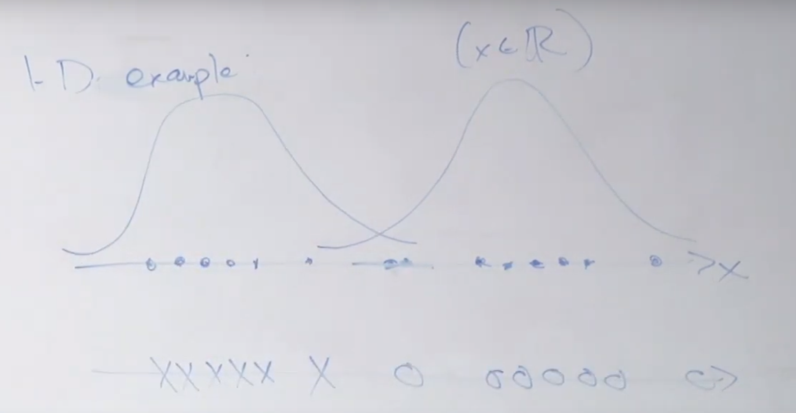

### Mixture of Gaussian Model

- Suppose there's a hidden/latent random variable $z$, and $x^i,z^i$ are jointly distributed ($m$ samples)
  - $p(x^i,z^i) = p(x^i|z^i)p(z^i)$

- where $z^i\sim \text{Multinomial}(\phi)$ (多项式分布), $z\sim\{1,\cdots,k\}$ , and $(x^i|z^i=j)\sim N(\mu_j,\Sigma_j)$
  - 多项式分布就是二项式分布(伯努利分布)从n=2到n=k
  - $\phi = \{\cdots, \phi_j\}$, and $\sum_j{\phi_j}= 1$
- **If we know $z^i$s,** we can use MLE: 
  - $L(\phi,\mu,\Sigma) = \sum\limits_{i=1}^mlogp(x^i,z^i|\phi,\mu,\Sigma)$
  - then we can get $\phi_j = \frac{1}{m}\sum\limits_{i=1}^mI(z^i=j)$, $\mu_j=\frac{\sum\limits_{i=1}^mI(z^i=j)x^i}{\sum\limits_{i=1}^mI(z^i=j)}$, $\Sigma_j = \cdots$

### M for GMM (expectation maximization)

- E-step: (Guess value of $z^i$s)
  - Set $\begin{aligned}\omega_j^i &= p(z^i=j|x^i,\phi,\mu,\Sigma)\\ &= \frac{p(x^i|z^i=j)p(z^i=j)}{\sum\limits_{l=1}^kp(x^i|z^i=l)p(z^i=l)}\end{aligned}$, $\omega^i_j$ means the probability of $x_i$ is coming from Gaussian$_j$ 
  - where $p(x^i|z^i=j)$ is Gaussian, and $p(z^i=j) = \phi_j$
- M-step: (Updates the parameters of our model based on our guesses)
  - $\begin{aligned}\phi_{j} &= \frac{1}{m}\sum\limits_{i=1}^{m}\omega_j^i\\ \mu_j &= \frac{\sum\limits_{i=1}^m\omega^i_jx_i}{\sum\limits_{i=1}^m\omega^i_j}\\ \Sigma_j &= \cdots\end{aligned}$
- So at **E-step** you estimate every $\omega^i_j$ with some given $\phi,\mu,\Sigma$, and at **M-step** you update  $\phi,\mu,\Sigma$ with rules from MLE.
  - Then you do these two steps in a loop: bootstrap.
  - $\phi,\mu,\Sigma$ might be random initialized at first.

- Finally $p(x_i) = \sum\limits_{i=1}^mp(x_i,z_i)$

- k-means is a hard clustering methods (each point will be assigned to one cluster)
- EM is a soft clustering method (each point will be assigned to one cluster with some possibility)

## 14.4 EM Algorithm

### Jensen's inequality

- Let $f$ be a convex function ($f''(x) \geq 0$), let $X$ to be a random variable, then $f[E(X)] \leq E[f(x)]$
  - 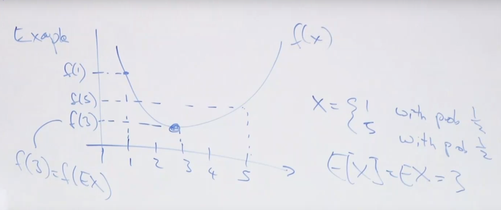
- Further, if $f''(x) > 0$ , f is strictly convex. 
  - then $f[E(X)] = E[f(X)] \iff X=\text{constant}\ (X = E[X]\text{ with probability 1})$
- And the whole thing works with concave functions, e.g. $\text{log}$ function.

### Density Estimation Problem (estimate P(x))

- Have model for $P(x,z;\theta)$, only observed $x$, **hidden variable $z$,** $\mathcal{D} = \{x^1, \cdots, x^m\}$

- $L(\theta) = \sum\limits_{i=1}^mlog\ p(x^i; \theta) = \sum\limits_{i=1}^mlog\sum\limits_{z^i}p(x^i,z^i; \theta)$

- **Want**: $\arg\max_{\theta}L(\theta)$

####  A glimpse of how we to that:

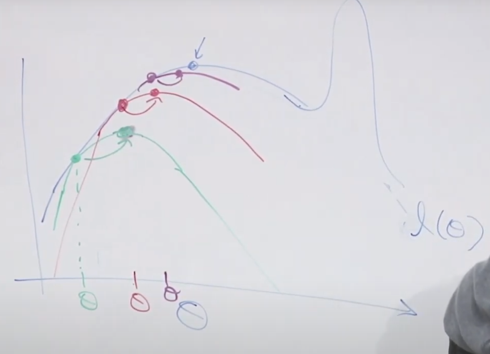

- At each E-step $i$ we draw a curve$^i$: 
  - The curve is the lower bound for the ground truth.
  - The curve equals to the ground truth at $\theta^{i-1}$
- At each M-step $i$ we move the $\theta^{i-1}$ to the optimal position $\theta^{i}$ of current curve$^i$
- The EM algorithm **will** converge to the local optimal.

#### A formal way of how we do that:

- The E-step
- E1: To get the lower bound:

$$
\begin{aligned}
&\arg\max_{\theta}\sum_{i}log\ p(x^i;\theta)\\
&= \sum\limits_ilog\sum\limits_{z^i}p(x^i,z^i;\theta)\\
&= \sum\limits_ilog\sum\limits_{{z^i}}Q_i(z^i)\frac{P(x^i,z^i;\theta)}{Q_i(z^i)} \\ & \text{ ,where } Q_i(z^i) \text{ is an (arbitrary) probability distribution, } \sum\limits_{z^i}Q_i(z^i)=1\\
&= \sum\limits_ilog\mathop{\mathbb{E}}\limits_{z^i\sim Q_i}\frac{P(x^i,z^i;\theta)}{Q_i(z^i)} \\
& \text{Using Jensen's inequality, the log function is concave}\\
& \geq \sum\limits_i\mathop{\mathbb{E}}\limits_{z^i\sim Q_i}log\frac{P(x^i,z^i;\theta)}{Q_i(z^i)}\\
& = \sum\limits_i\sum\limits\limits_{z^i\sim Q_i}Q_i(z^i)log\frac{P(x^i,z^i;\theta)}{Q_i(z^i)} \\
& \text{Note: this function is just about }\theta \\
\end{aligned}
$$

- E2: To make the two curves **equal** at current iteration parameter $\theta$:
  - We need $\frac{P(x^i,z^i;\theta)}{Q_i(z^i)} = \text{constant}$
  - We can set $Q_i(z^i) \propto P(x^i,z^i;\theta)$, and we need $\sum\limits_{z^i}Q_i(z^i)=1$:
    - One solution: $\begin{aligned}Q_i(z^i) &= \frac{P(x^i,z^i;\theta)}{\sum\limits_{z^i}P(x^i,z^i;\theta)}\\ &= P(z^i| x^i;\theta) \end{aligned}$

- The M-step:
  - $\theta = \arg\max\limits_{\theta} \sum\limits_i\sum\limits\limits_{z^i\sim Q_i}Q_i(z^i)log\frac{P(x^i,z^i;\theta)}{Q_i(z^i)}$

#### A brief summary:

- E-step:
  - Set $Q_i(z^i) = P(z^i| x^i;\theta)$
- M-step:
  - $\theta = \arg\max\limits_{\theta} \sum\limits_i\sum\limits\limits_{z^i\sim Q_i}Q_i(z^i)log\frac{P(x^i,z^i;\theta)}{Q_i(z^i)}$

### Converge proof

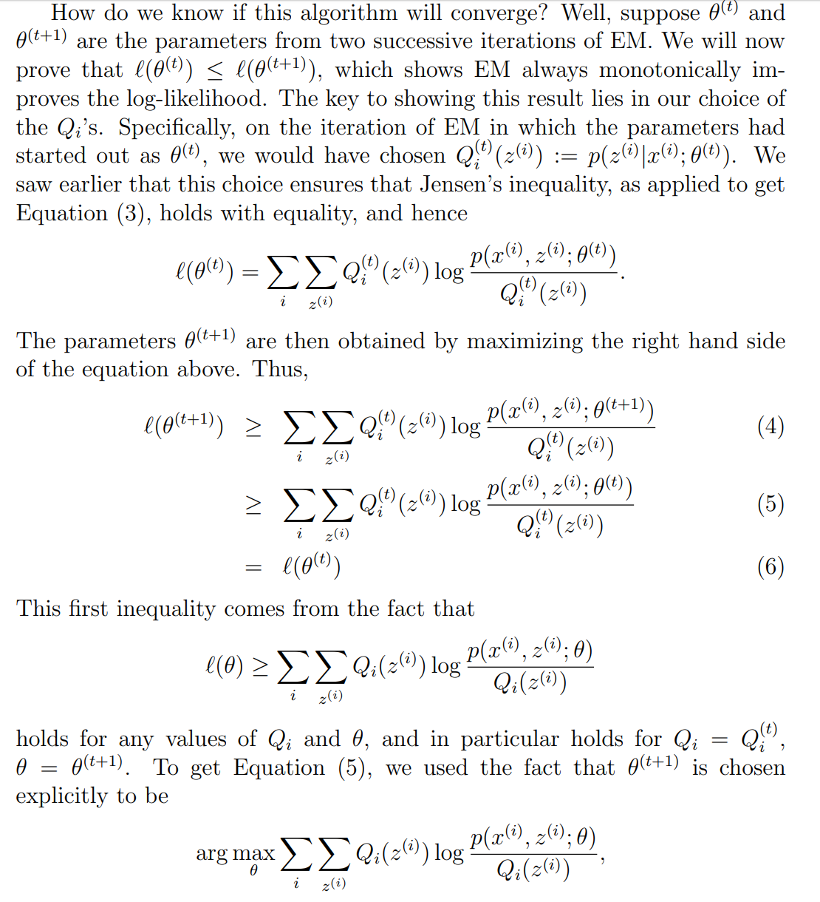

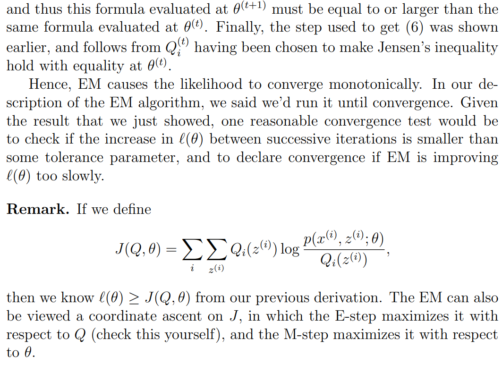

# Lecture 15 - EM Algorithm & Factor Analysis

