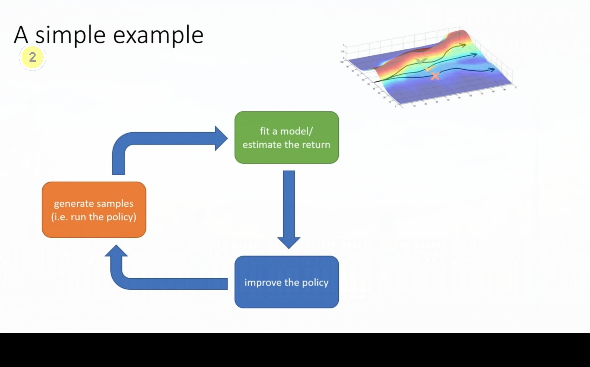
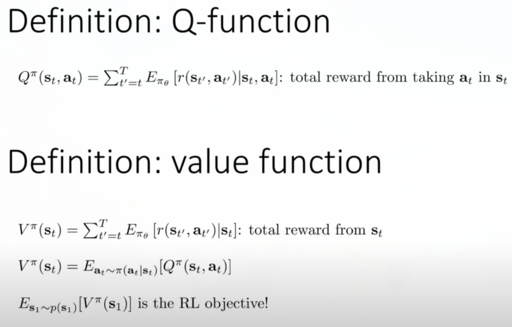
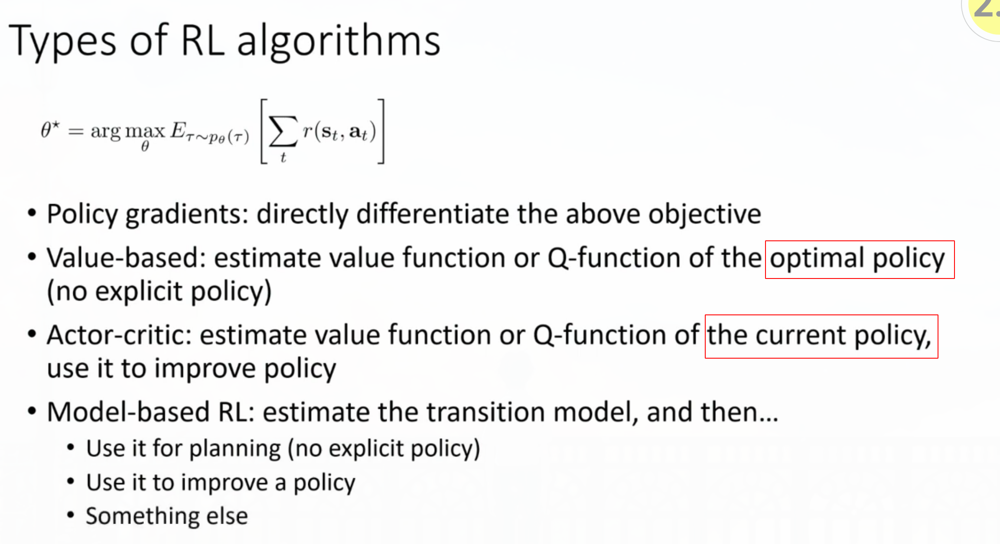
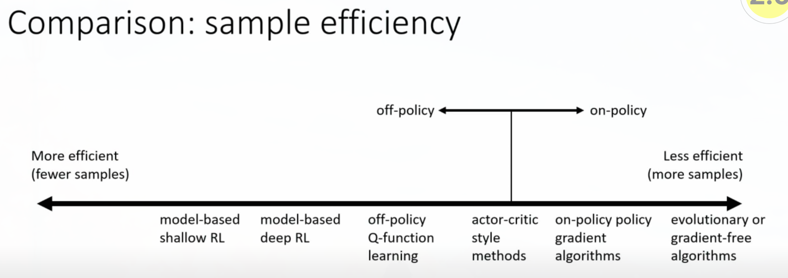

# Lecture 1

# Lecture 4

## 4.1. Definition of MDP 

- Markov chain: $\mathcal{M}=<\mathcal S, \mathcal T>$. (state space and transition operator).
  - Let $\mu_{t,i}=p(s_t=i)$, $\overrightarrow \mu_{t+1}=\mathcal T \overrightarrow \mu_t$
- Markov decision process: $\mathcal{M}=<\mathcal S, \mathcal A, \mathcal T, r>$.
- Partially observed MDP: $\mathcal{M}=<\mathcal S, \mathcal A, \mathcal O, \mathcal T, \varepsilon, r>$, where $\varepsilon$ stands for emission probability $p(o_t|s_t)$.

## 4.2. Definition of RL problem

- $\underbrace{p_\theta(s_1,a_1,\cdots,s_T,a_T)}_{p_\theta(\tau)}=p(s_1)\mathop\Pi\limits_{t=1}^T\underbrace{\pi_\theta(a_t|s_t)p(s_{t+1}|s_t,a_t)}_{\text{Markov chain on (s,a)}}$.

  - Once $\pi_\theta$ is fixed, you can actually view the MDP as a *Markov chain* on an augmented state space (original $\mathcal S$ and $\mathcal A$), $p((s_{t+1},a_{t+1})|(s_t,a_t))=p(s_{t+1}|s_t,a_t)\pi_\theta(a_{t+1}|s_{t+1})$.

- $\theta^*=\arg\max\limits_{\theta}E_{\tau\sim p_{\theta}(\tau)}\left[\sum\limits_{t=1}r(s_t,a_t)\right] $. (Goal)

  - $= \arg\max\limits_{\theta}\sum\limits_{t=1}^TE_{(s_t,a_t)\sim p_\theta(s_t,a_t)}[r(s_t,a_t)]$. (Markov Chain)
  - And thus $\begin{pmatrix}s_{t+k}\\a_{t+k}\end{pmatrix}=\mathcal T^k\begin{pmatrix}s_{t}\\a_{t}\end{pmatrix}$, if $T=\infty$, will $p(s_t,a_t)$ converge to a *stationary* distribution? (just solve $\mu=\mathcal T \mu$)?
    - Yes, under ergodicity.
    - And the expected return under infinite horizon is **dominated** by the stationary state, and thus the objective is $\arg\max\limits_{\theta}E_{(s,a)\sim p_\theta(s,a)}[r(s,a)]$.

- > Even if you take expectations of non-smooth, non-differentiable nasty horrible functions, they can actually be reasonably behaved in the parameters of the distribution under with you take expectation. $\leftarrow$ why GD can work in RL.

## 4.3. Anatomy of a RL algorithm

- 

- How do we deal with *expectations*?
  -  
  - But actually it's not that easy to modify $\pi_\theta$, because $Q$ is also dependent on $\pi_\theta$, but this is the intuition of $Q$.
- The value function and the Q-function:
  - 
  - Idea 1: if we know $Q_{\pi_\theta}$, we can improve $\pi$ greedily.
  - Idea 2: if $Q_{\pi_\theta}(s,a)>V_{\pi_\theta}(s)$, then $a$ is **better than average**. 

## 4.4. Brief overview of RL algorithm types

- 
  - AC is the combination of PG and value-based (it use value function in PG to improve policy).
- Consideration for algorithm selection:
  - Sample efficiency.
  - Stability (convergence) and ease use.
  - Assumptions (observability, episodic learning, continuity or smoothness)
- 