# Lecture 01

# Lecture 04

## 4.1. Definition of MDP 

- Markov chain: $\mathcal{M}=<\mathcal S, \mathcal T>$. (state space and transition operator).
  - Let $\mu_{t,i}=p(s_t=i)$, $\overrightarrow \mu_{t+1}=\mathcal T \overrightarrow \mu_t$
- Markov decision process: $\mathcal{M}=<\mathcal S, \mathcal A, \mathcal T, r>$.
- Partially observed MDP: $\mathcal{M}=<\mathcal S, \mathcal A, \mathcal O, \mathcal T, \varepsilon, r>$, where $\varepsilon$ stands for emission probability $p(o_t|s_t)$.

## 4.2. Definition of RL problem

- $\underbrace{p_\theta(s_1,a_1,\cdots,s_T,a_T)}_{p_\theta(\tau)}=p(s_1)\mathop\Pi\limits_{t=1}^T\underbrace{\pi_\theta(a_t|s_t)p(s_{t+1}|s_t,a_t)}_{\text{Markov chain on (s,a)}}$.

  - Once $\pi_\theta$ is fixed, you can actually view the MDP as a *Markov chain* on an augmented state space (original $\mathcal S$ and $\mathcal A$), $p((s_{t+1},a_{t+1})|(s_t,a_t))=p(s_{t+1}|s_t,a_t)\pi_\theta(a_{t+1}|s_{t+1})$.

- $\theta^*=\arg\max\limits_{\theta}E_{\tau\sim p_{\theta}(\tau)}\left[\sum\limits_{t=1}r(s_t,a_t)\right] $. (Goal)

  - $= \arg\max\limits_{\theta}\sum\limits_{t=1}^TE_{(s_t,a_t)\sim p_\theta(s_t,a_t)}[r(s_t,a_t)]$. (Markov Chain)
  - And thus $\begin{pmatrix}s_{t+k}\\a_{t+k}\end{pmatrix}=\mathcal T^k\begin{pmatrix}s_{t}\\a_{t}\end{pmatrix}$, if $T=\infty$, will $p(s_t,a_t)$ converge to a *stationary* distribution? (just solve $\mu=\mathcal T \mu$)?
    - Yes, under ergodicity.
    - And the expected return under infinite horizon is **dominated** by the stationary state, and thus the objective is $\arg\max\limits_{\theta}E_{(s,a)\sim p_\theta(s,a)}[r(s,a)]$.

- > Even if you take expectations of non-smooth, non-differentiable nasty horrible functions, they can actually be reasonably behaved in the parameters of the distribution under with you take expectation. $\leftarrow$ why GD can work in RL.

## 4.3. Anatomy of a RL algorithm

- 
- Value-based algorithms don't have a essential policy ($\arg\max$ if any).
- How do we deal with *expectations*?
  -  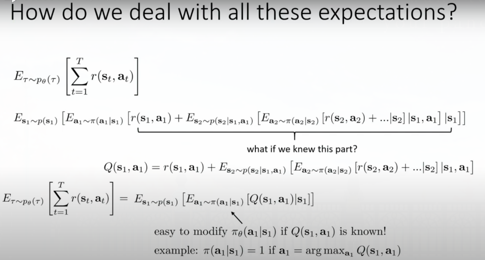
  - But actually it's not that easy to modify $\pi_\theta$, because $Q$ is also dependent on $\pi_\theta$, but this is the intuition of $Q$.
- The value function and the Q-function:
  - 
  - Idea 1: if we know $Q_{\pi_\theta}$, we can improve $\pi$ greedily.
  - Idea 2: if $Q_{\pi_\theta}(s,a)>V_{\pi_\theta}(s)$, then $a$ is **better than average**. 

## 4.4. Brief overview of RL algorithm types

- 
  - AC is the combination of PG and value-based (it use value function in PG to improve policy).
- **Consideration** for algorithm selection:
  - Sample efficiency.
  - Stability (convergence) and ease use.
  - Assumptions (observability, episodic learning, continuity or smoothness)
- 

# Lecture 05

- Evaluate the objective: 

## 5.1. Policy Gradient

- 
  - 
  - **Why** is the reward independent of $\theta$?
    - If the policy change, the expectation of reward will change, which is accounted for at the front term, but once you sampled $s_t,a_t$ from your policy, the reward will only depend on $s_t,a_t$.
- Basic components of RL algorithm (PG) / *REINFORCE* algorithm:
  - generate samples: just run the policy.
  - fit a model to estimate return: just run the policy.
  - improve the policy: $\theta=\theta+\alpha\nabla_\theta J(\theta)$
- PG vs. MLE:
  - $\nabla_\theta log\,\pi_\theta(\tau)$ actually points at the direction that increase $\pi_\theta(\tau)$ (the probability of $\tau$).
  - 
    - PG only increase the probability of **good** trajectories, while MLE increase the probability of all trajectories. So PG is like *a weighted version* of MLE.
    - BTW, we might use the built-in MLE-gradient to compute the gradient of PG.
- Markov Properties are **NOT** actually used in PG, so we can deduct the “exact” derivatives at **Partial Observation**:
  - 
- Why PG won't work?: *the gradient* has high variance!
  - Assume we are trying to tuning a Gaussian policy, and receive three samples, one negative one the left and two positive one the right. $\rightarrow$: penalty(left); encourage(right)
  - 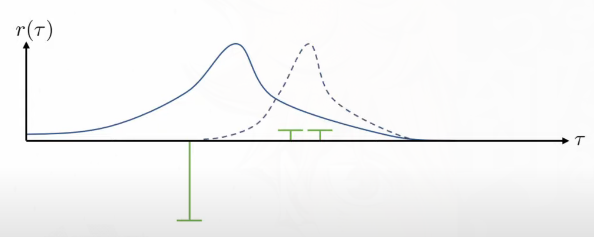
  - **After adding a big constant to all samples**  $\rightarrow$: encourage(left); encourage(right), so the policy won't shift that much to the right compared to the above one.
  - 
  - **What if the two "good" rewards are zero**?
    - You policy (center of the Gaussian) will shift either left or right depending on the previous position of your policy. (either coming from the left or the right).

## 5.2. Basic variance reduction: causality

- *Causality*: The action you choose **now** will **not** affect the rewards you received in the **past**. $\neq$ Markov properties.
  - 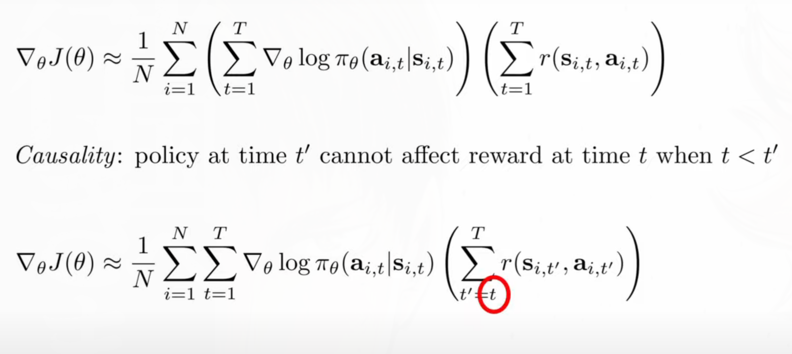
- This is a still **unbiased estimation** of PG, but with **more** variance. (see paper for proof)
  - $\sum\limits_{i=1}^N\sum\limits_{t=1}^{T}\nabla_{\theta}log\pi_\theta(a_{i,t}|s_{i,t})(\sum\limits_{t'=1}^{t-1} r(s_{i,t'},a_{i,t'})) = 0$
    - For that $E_{\tau\sim p(\theta)}[\nabla_\theta log\, \pi_\theta(\tau)\cdot b] = 0$, as long as $b$ is constant w.r.t. $\theta$ and $\tau$
  - $原式 = \sum\limits_{t=1}^T\mathbb{E}_{s_t,a_t}[\nabla_\theta log\pi_\theta(a_t|s_t)(\sum\limits_{t'=1}^{t-1} r(s_{i,t'},a_{i,t'}))]$, and $(\sum\limits_{t'=1}^{t-1} r(s_{i,t'},a_{i,t'}))$ is constant w.r.t. $\theta$ and $a_t$.

## 5.3. Basic variance reduction: baselines

- We only want the trajectories which are "better" than average to be more often.
  - 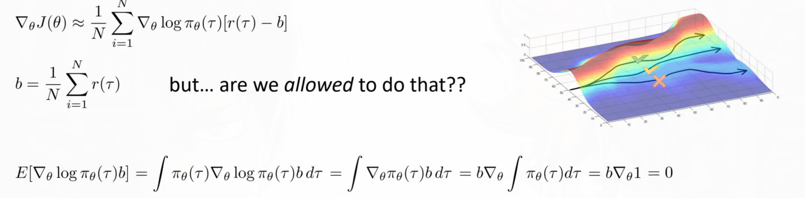
  - Still **unbiased**, but will alter the variance.
-  Analyzing variance for acquiring optimal *b*:
  - 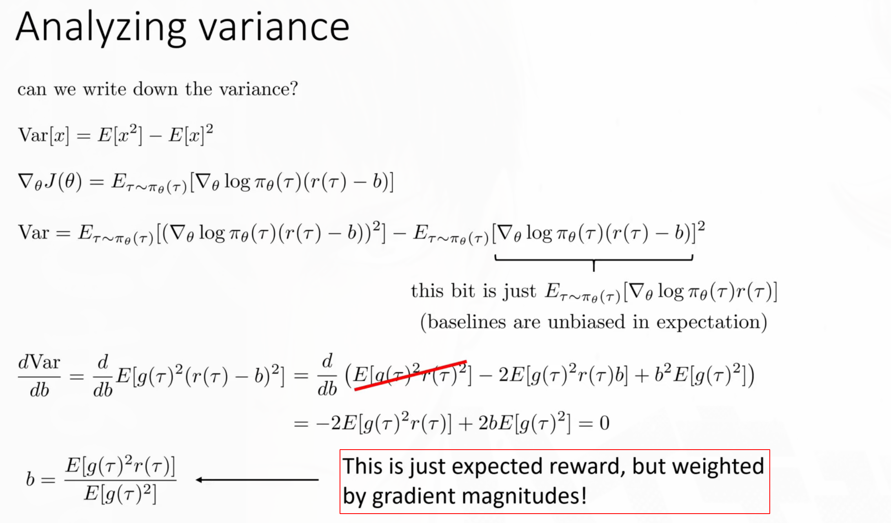
  - The second term of the variance is independent of $b$, so we only need to focus on the former one.
  - 结论: 最优的baseline是不同$r(\tau)$基于$g(\tau)^2$ (gradient magnitude)的**加权平均**.
    - 注: 不要直接考虑$\nabla_\theta\,log\pi_\theta(\tau)$是向量的情况, 因为那样的话我们就不能仅仅优化Var了,因为Var是矩阵了,优化一个矩阵是一个不明确的操作.
    - 如果$\theta$是向量, 那你可以对它的每一个维度进行上述计算, 所以最后对于$\theta$不同的维度会有不同的optimal $b$.

## 5.4. On-policy via Off-policy

- Importance Sampling (**IS**):
  - 
  - **需要满足条件**: $p(x)f(x)$ is always 0 whenever $q(x)=0$.
  
- Problem: the important coefficient will increase the variance:
  - Consider *causality*: (NOTE: $\pi_\theta(\tau)=p(s_1) \mathop\Pi\limits_{t=1}^T\pi_\theta(a_t|s_t)p(s_{t+1}|s_t,a_t)$)
    - 
    - Causality is **NOT** an *arbitrary* modification, it's equal to its previous formulation.
  - Ignoring the latter [product](下图中的乘积项) will result in the **policy iteration** algorithm.
    - Note that you will get a *different gradient* after this modification, but the new gradient **will still improve** your policy, but for a different reason.
    - 
  
- A first-order approximation of IS.
  
  - 
  - The importance coefficient is exponential in $T$, and we can assume it's smaller/bigger than $1$, so the product will decrease to zero / increase to infinity essentially fast ($\Leftrightarrow$ the variance will increase to infinity), which is troublesome.
  - **How to write the objective differently**: so instead of importance sampling over **entire trajectories**, you can just consider the importance sample over the **state-action joints**. 
  - **Ignore the state portion**: when ignoring the state marginal distribution, you actually didn't get the right gradient, but this will only result in bounded error when $\theta'$ is not too far from $\theta$.

## 5.5. Implementing Policy Gradients

- 
  - Assume $\theta\in\mathbb{R}^n$ ($n$ can be very high for NN), then direct calculation will require $N\times T\times n$ times.
  - We want to utilize the back propagation. $\rightarrow$ we need a **graph** such that its gradient is the policy gradient.
- ???: YouTube上的代码似乎是一种自己根据REINFORCE定义的东西: $\nabla\mathcal{L}(a_\theta, a_{\theta'})q(a_\theta, a)$

## 5.6. Advanced Policy Gradient

- Numerical issue with PG:
  - Different **gradient magnitude** at different parameters. So the gradient might be dominant by some parameter. e.g. $\nabla_\theta J(\theta)=\begin{bmatrix}1000000\\1\end{bmatrix}$
  - Some parameter **affect the policy** a lot more than others. e.g. $\pi_\theta(s)=\theta_1^{10}s_1+\theta_2s_2$, it's hard to assetsk one *step size* for all parameters.
- **Covariant/natural Policy Gradient**:
  - The constrained optimization view of PG:
    -  $\rightarrow$ this's actually maximize the first order Taylor expansion of $J(\theta')$ at $\theta$.
  - We want the step to be the same in **policy space** rather than in **parameter space**.
    - 
    - We usually use KL-divergence, but to simplify, we use the second order Taylor expansion as surrogate of KL-divergence.
      - 
      - The Fisher-information matrix can be estimated through samples.
    - Finally: 
      - And the solution is , where $\alpha$ is your Lagrange multiplier.
  - Related works:
    - 

# Lecture 06 Actor-critic Algorithms

- The key idea for this lecture is to find *better estimate* of $\hat Q(s,a)$.

## 6.1. Improving the policy gradient with a critic

- Due to the stochasticity of RL, a better **"reward to go"** can be an **average** over possible trajectories; and this also bring less variance than single trajectory sample. $Var(\bar X)=\frac{1}{n}Var(x_i)$
  - 
- Subtract a **baseline** which denotes `average reward`. 
  - Average of what? 
    - Depend on the Q-value: $\frac{1}{N}\sum\limits_{i}Q(s_{i,t},a_{i,t})$ 
    - Depend on the state: $V(s_t)=E_{a_t\sim\pi_\theta(a_t|s_t)}[Q(s_t,a_t)]$)
  - The **advantage function**$A(s_{i,t},a_{i,t}) = Q(s_{i,t},a_{i,t})-V(s_{i,t})$: 
    - How better this action is than the average action.
    - 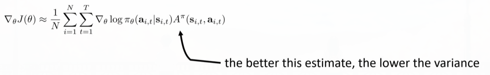
      - Some time in algorithm, the advantage function might be biased, but it's worthy because of the enormous variance reduction.
    -  

## 6.2. The policy evaluation problem

- Monte Carlo policy evaluation:
  - Traditional MC: It's a little hard to calculate $\sum\limits_i\sum\limits_{t'=t}^Tr(s_{i,t'},a_{i,t'})$ because this requires to reset the simulator to the exact state $s_{t'}$.
  - MC evaluation with **function approximation** (Neural Network)
    - $V^{\pi}(s_t)\approx\sum\limits_{t'=t}^Tr(s_{t'},a_{t'})$. => 
    - It's not good as $\sum\limits_i\sum\limits_{t'=t}^Tr(s_{i,t'},a_{i,t'})\Rightarrow$ "sample multiple trajectory $s_t$", but still good estimation.
    - : 
      - Also, even if you can't visit the same state, but as you visit nearby state, the function approximator will learn to know that nearby states probably have similar rollouts => less variance in prediction.
- Improve the *target* used in MC evaluation: 
  - 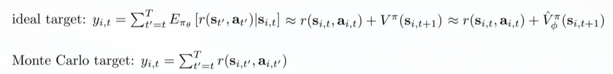
  - The ideal target is a slightly incorrect because of $\bar V_\phi^\pi(s_{i,{t+1}})$ can be noisy, so at initial state it's better to use MC target. But the ideal target has lower variance (especially useful when the environment is very stochastic). 
  - Using ideal target is referred to a `bootstrapped` estimate.

- An AC algorithm:
  - 

## 6.3. Discount factors

- When $T\rightarrow\infty$, $\bar{V}^{\pi}_{\phi}$ can get infinitely large in many cases. Simple trick. use $\gamma\in[0,1], e.g.\,0.99$, the philosophy is: `better to get rewards sooner than later`.
  
  - Why: 1) in most ways, we care more about the present reward; 2) the agent might "die" before receives future reward, we can use $\gamma$ to **model** it. 3) it's also a bias-variance trade off. ([see](#6.4))
    - $\gamma$ **changes** the MDP, the agent now has the probability $1-\gamma$ to die at every state.
      - 
  
- PG with discount factors:
  -  
  
  - The critic  is actually **equals to** option 1:
    
    - $\hat{V}_\phi^\pi(s_{t_0})=\sum\limits_{t=t_0}^T\gamma^{t-t_0}r(s_t,a_t)=r(s_{t_0},a_{t_0})+\gamma\hat{V}_\phi^\pi(s_{t_0+1})$
    
  - And if we change the form of option 2 using causality trick:
    
    - 
    - 
    - Because of the discount, not only we care less about the *reward* in the future, but also care less about the *decision* in the future. (`Making right decisions is more important at earlier stage.`)
    
  - Option 1 is we frequently use, while option 2 is **the right solution for** dealing with the MDP where you actually have probability $1-\gamma$ to die at every state *or* the MDP with discounted objective $E_{\tau\sim p_\theta(\tau)}[\sum_t\gamma^t r(s_t,a_t)]$.
    
    - In option 1, $\gamma$ can be viewed as a way to eliminate variance in your value estimator.
    
    - Further reading:
    
      - > Bias in natural actor-critic algorithms. ICML 2014.
  
- **Online** actor-critic algorithm:

  - 

## 6.4. The actor-critic design decisions

- Architecture design:
  - 
    - In shared network design, the **shared layers** get gradients both from *policy* and *value function*. So you have to carefully balance two different gradient (and their magnitudes) so that one won't be blown off by the other.
  
- Batch-size:

  - One way to minimize variances.
  - The state/action pair in batches shouldn't be too correlated. So a better choice for online RL is to use *parallel workers*:
    - 
  - `Remark`: In asynchronous AC, one problem is some agents might use older $\theta$ even if $\theta$ has been updated, but AC is an **on-policy** algorithm.

- **Critic as baselines**:

  - 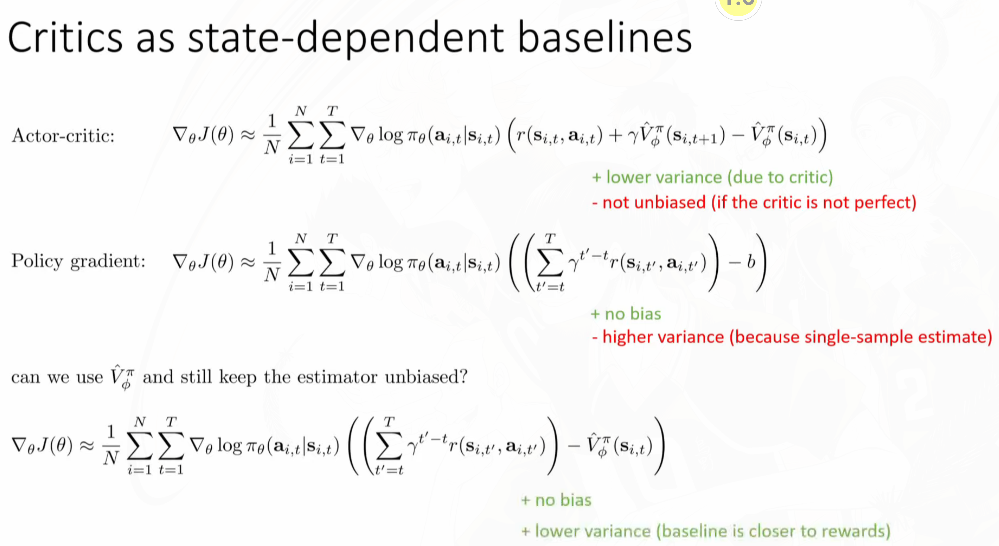
    - The baseline can depend only on *state*, while it's expectation still works out to zero. (可以仿照之前证明b在期望下为零证明, 思路基本一致, 做对于$(s,a)$ pair的期望.)
    
  - **Action-dependent baselines**:
- 
    - Action-dependent baselines don't integrate to zero but an **error term**, so you have to account for the error term.
    - `Why bother using this method?`: sometimes the second term can be estimated very accurately, because the estimation doesn't involve in new states, so you don't need to interact with the environment and thus you can generate a huge number of samples. Also, if you carefully choose the model for your policy and Q-function, the second term might have an analytical solution.
      - So the variance of the *total equation* will be small.
    - Further reading : Gu et al. 2016 (Q-prop)
  
- **Eligibility traces & n-step returns**:
  - 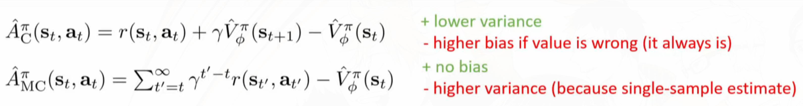
  - We want to combine these two, and use $\hat{A}^\pi_{MC}$ (Monte Carlo)in the short term and $\hat{A}^\pi_{C}$ (Critic) in the long term:
    - $\hat{A}^\pi_{MC}$ will have high variance in the future, because it's single-sample estimate.
    -  $\hat{A}^\pi_{C}$ will have less bias in the future, because when using discount factor, your reward usually converges to zero.
    - So one way is to **cut off the tails** in $\hat{A}^\pi_{MC}$, so we won't be affected by the high variance caused by the infinite future, and use critic $\gamma^n\bar{V}_\phi^\pi(s_{t+n})$  to **compensate** for it. (在这里$\sum\limits_{t'=t}^{t+n}$表示$t'\in[t,t+n$$)$$\Rightarrow$n-step).
      - 
      - 
  
- **GAE**:
  - *What if we want to choose multiple n*?
  - 
  
  - So implement discount alone can be interpreted as variance/bias trade-off: because for smaller $\gamma$, it's eliminate the MC-estimation with large *n*, which has large variance, but small bias. 

# Lecture 07 Value Function Methods

## 7.1. Value function (Policy iteration)

- **Policy iteration**: = policy evaluation + policy improvement
  - 

- Can we **omit** Policy Gradient completely? $\rightarrow$ `value function methods`
  - Yes: $A^\pi(s_t,a_t)$ denotes how much better is $a_t$ than the average action according to $\pi$ at $s_t$. And $\arg\max\limits_{a_t}A^\pi(s_t,a_t)$ is actually the best action at $s_t$ if we then follow $\pi$. As we actually know **how to act** if we have $A^\pi(s_t,a_t)$, we don't need an explicit policy. And we know **how to improve** it by setting $\pi'(a_t|s_t)=\{\begin{aligned}&1 \text{ if } a_t = \arg\max\limits_{a_t}A^\pi(s_t,a_t)\\&0 \text{ else} \end{aligned}\ $, this will improve your policy for any $\pi$.
- Evaluation of $A^\pi(s,a)$ in Policy Iteration:
  - **Dynamic Programming:**
    - Assume: $p(s'|s,a)$ is known, $S,A$ are small and discrete.
    - E.g. 
  - Simpler DP with **Q-function**:
    - $A^\pi(s,a)=r(s,a)+\gamma E_{s'}[V^\pi(s')]-V^\pi(s)\approx r(s,a)+\gamma E_{s'}[V^\pi(s')] = Q^\pi(s,a)$.
    - The policy is to find $\arg\max A^\pi(s,a)=\arg\max Q^\pi(s,a)$, and to update $V$, $V^\pi(s)=E_{a\sim\pi(a|s)}[r(s,a)+\gamma E_{s'}V(s')]=_{a=\arg\max Q(s,a)}Q(s,a)$.
      - So we can skip this step by just updating $V$ with the value of $\max Q^\pi(s,a)$ and we derive *value iteration*.
    - **Value Iteration**:
      -  
      - `Remark`: 
        -  *Value iteration*中的$E_{s'\sim(s'|s,\pi(s))}$也可以不用知道Transition dynamics, 而是直接使用sample做估计. **但是DP是需要transition dynamic**的.
        -  *Value iteration*中利用了$Q$和$V$(的关系)在做迭代 $=$ 用$Q$或$V$自己的*Bellman-equation*做*Bootstrap*迭代.
        -  但是`value iteration` i.e. $V^\pi(s)\rightarrow$$\max\limits_a$$\{r(s,a)+\gamma E_{s'}[V^\pi(s')])\}$. $\neq$ `policy evaluation` : i.e. $V^\pi(s)\rightarrow r(s,\pi(s))+\gamma E_{s'}[V^\pi(s')])$.
        -  前者在更新`value`的同时在更新`policy`, 后者仅仅是根据`policy`在做估计.
        -  `value iteration`就是对于`argmax` policy 的`policy evaluation`, 因为这个*greedy*的policy可以保证提升.

## 7.2. Fitted Value Iteration & Q-Iteration

> **`Fitted` means you use a function approximator to *fit* the value function.**

- Fitted value iteration: "value iteration with function approximator" $\Leftarrow$ Requre to know the transition dynamics! $E(V(s'))$
  - $\Leftarrow$ Supervised learning for $V_\phi$
  - When we don't have the **transition dynamics**:
    - Policy evaluation:
      - $V^\pi(s)\rightarrow r(s,\pi(s))+\gamma E_{s'\sim p(s'|s,\pi(s))}[V^\pi(s')]$ $\Leftrightarrow$ $Q^\pi(s,a)\rightarrow r(s,a)+\gamma E_{s'\sim p(s'|s,a)}[Q^\pi(s', \pi(s'))]$.
      - The difference between these two might sound subtle, but it's very important! Because the sample of $s'$ **doesn't depend on the policy**, so we can reuse the $(s,a,s')$ pair even when $\pi$ has changed. 
      - Both of them **doesn't require knowing the transition dynamics**, you can just use samples for estimation. 
  - **Fitted $Q$ iteration algorithm**:
    - 
      - Because the policy $\pi$ is greedy, so:
        - $Q^\pi(s,a)\rightarrow r(s,a)+\gamma E_{s'\sim p(s'|s,a)}[Q^\pi(s', \pi(s'))])\rightarrow r(s,a)+\gamma E_{s'\sim p(s'|s,a)}[\max_{a'}Q^\pi(s', a')] \xrightarrow{\text{sampling}} r(s,a)+\gamma \max_{a'}Q^\pi(s', a')$
      - Works for off-policy:
        - Because $r(s_i,a_i)+\gamma \max_{a'}Q_\phi(s_i',a_i')$ doesn't depend on the policy $\pi$. (one interpretation is our policy is $\arg\max$, so our policy + $Q$ equals to $\max Q$, which offset $\pi$.)
        - So you just need $(s,s',a)$ pair to improve your $Q$ while you don't really care where do they come from.
    - General form:
      - 

## 7.3. From Q-iteration to Q-learning

- What's fitted Q-iteration optimizing:
  - 
- Online Q-learning algorithms:
  -  $\Leftarrow$ policy is $\arg\max$, which is *greedy*.
    - You take **one** action, and perform **one** update.
  - Exploration with Q-learning: $\epsilon$-*greedy*; $\pi(a_t|s_t)\propto \exp(Q_\phi(s_t,a_t))$.

## 7.4. Value functions in theory

- Bellman Operator $\mathcal B$:
  - 
  - `NOTE`:
    - $V$ is a vector, which stands for $\begin{bmatrix}V(s_1)\\\cdots\\V(s_n)\end{bmatrix}$.
    - $V^*$ always exists, always unique, always corresponds to the optimal policy.
  - Convergence:
    - 
- **Non-tabular** value function learning:
  - 
  - Where $\Omega$ is all possible value function in the approximator space (e.g. NN).
  - The general procedure is: $V\rightarrow \mathcal BV\rightarrow$ find the nearest $V'\in\Omega$ to $\mathcal BV$. (projection).
    - 
    - Define a new operator $\Pi:\Pi V=\arg\min_{V'\in\Omega}\frac{1}{2}\sum||V'(s)-V(s)||^2$, and $\Pi$ is a *projection* onto $\Omega$ in terms of $l_2$ norm. And it's a contraction, because when you project two vector to a line, they can't get further, they will normally get closer. 
  - `Remark`:
    - 
    - $\mathcal B$ is contraction w.r.t. $l_{\infty}$, $\Pi$ is contraction w.r.t. $l_2$; but **$\Pi\mathcal B$** is **NOT** contraction of any kind.
  - Fitted **Q**-iteration suffers the same limitation: no general convergence guarantee.
    - Q-learning is **NOT** gradient descent of any well-defined objective:
      - Because you don't consider the gradient of the target value. (Even if you do, which is *the residual algorithm*, it has very poor numerical properties.)
      - 
- The fitted **bootstrapped policy evaluation** in batch AC doesn't generally converge:
  - 

## 7.5. Value iteration versus Policy iteration

> Value iteration是Policy evaluation过程只进行一次迭代的Policy iteration。[link](https://zhuanlan.zhihu.com/p/77650102)

# Lecture 08 Deep RL with Q-Functions

## 8.1. Correlated samples in online Q-learning

- Problem: 
  - *Sequential states* (local highly correlated window) may cause your Q-function to always overfit to the current seen trajectory.
    - Countermoves: synchronized/asynchronized parallel Q-learning....
  - *Changing target value*: it's like chasing its own tail. The target changes every time after you apply the gradient update, so it's hard for $Q_\phi$ to converge.
    - Countermoves: target network....
- **Relay buffers**:
  - 
  - We also need some strategy to sample trajectories for feeding the replay buffer.
  - $K=1$ is common, but larger $K$ is more efficient

## 8.2. Target Networks

- Q-learning with replay buffer and target networks:
  - 
- "Classical" deep Q-learning algorithm:
  - Same as the above with $K=1$.
- Alternative target network:
  - `Different lay`: right after you update $\phi'$, the lag between $\phi$ and $\phi'$ is going to be big. But when $\phi'$ has been fixed for a number of iterations, the lag between $\phi$ and $\phi'$ is going to be small. So one intuition is, can we want the lag between $\phi$ and $\phi'$ to be roughly the same during iteration?
  - **Updating $\phi'\leftarrow\tau\phi'+(1-\tau)\phi$** every time after you update $\phi$. ($N=1$).
    - $\tau=0.999$ works well. However, mixing NN parameters is tricky. (Linear mixing of nonlinear function parameters)
    - Further reading: Polyak averaging.

## 8.3. A General View of Q-learning

- Different Q-learning algorithms are changing the speed of different processes.

## 8.4. Improving Q-learning

- Overestimation in Q-learning
  - $Q_\phi(s,a)=r(s,a)+\max_{a'}\gamma Q_{\phi’}(s',a')$
    - Your Q-function is not perfect, it's noisy. And the **argmax** will always select the **positive noises**, which results in *overestimation.*
  - 
    - Intuitively, if we can decorrelate the noise in the *action selection ($\arg\max $)* and the noise in the Q*-value*, the problem can go away $\Rightarrow$ double Q-learning
    - Luckily, we already have double networks in Q-learning, so we don't need to introduce another network, instead we can use $\phi$ and $\phi'$ for value estimation and action selection separately:
      - ; but the decorrelation is definitely not always perfect, because $\phi\approx\phi'$ sometimes. 
- **Multi-step returns**:
  - Q-learning target: $y_t=r_t+\gamma\max_{a_{t+1}}Q_{\phi'}(s_{t+1},a_{t+1})$
    - If your Q-function is pretty bad, the target can only depend on the instant reward $r_t$, while $Q_{\phi'}(s_{t+1},a_{t+1})$ only contributes to the **noise**. $\Rightarrow$ At initial stage, Q-function is very biased, and your update will thus be awful.
  - The alternative is the *MC-target*, which is the sum of discounted reward, it has high variance (single sample estimation), but it's unbiased.
  - **Multi-step target/N-step return estimator:** 
  - Q-learning with N-step returns:
    - It's a less biased target especially when Q-values are incorrect, and thus results in faster learning during the early stage.
    - **Can only be applied to on-policy learning**! (or else you need to add off-policy modification factor)
      - $\Rightarrow$ because the MC-target needs to be sampled based on current policy $\pi$ as it's a target for $Q_{\pi}$.
      - On-policy: we need transitions $s_{t'},a_{t'},s_{t'+1}$ from $t$ to $t+N-1$.
    - Further reading: Safe and efficient off-policy reinforcement learning.

## 8.5. Q-learning with  Continuous Actions

- Problem with continuous action: $\arg\max$
  - 
- Potential solutions:
  - Stochastic optimization: 
    - 
    - More accurate; iterative stochastic optimization: Cross-entropy method (CEM); CMA-ES
  - Use function class that is easy to optimize: e.g. *function class with closed form solutions for their optimal answers.* 
    - Quadratic functions. e.g. Normalized Advantage Functions:
      - 
      - It's non-linear in the state, but it's quadratic in terms of the action given state.
  - Learn an approximate maximizer:
    - Train $\mu_\theta(s)$ such that $\mu_\theta(s)\approx\arg\max_a Q_\phi(s,a)$. You can also perceive $\mu_\theta(s)$ as some kind of *policy*.
      - Updating $\theta$: $\frac{dQ_\phi}{d\theta}=\frac{da}{d\theta}\frac{dQ_\phi}{da}$.
    - DDPG:
      -  

## 8.6. Implement Tips and Examples

- Simple practical tips for Q-learning:
  - Q-learning takes some care to stabilize: first task on easy, reliable task first, make sure your implementation is right (bugs/hyper parameters).
  - Large replay buffers help improve stability.
  - It takes time. [detail](it might be no better than random for a while, but it will get better once valuable transitions are found.)
  - Start with high $\epsilon$ (exploration) and decrease gradually. Schedule the learning rate (high to low), too. Adam optimizer can also help.
  - Bellman error gradients can be big; clip gradients or use Huber loss .
    - For example there might be *huge negative reward* trajectories during early stage of exploration, the gradient of them might blow off your parameters. $\Rightarrow$ even if you don't care how bad it is, your Q-function will try to estimate exactly how bad it is if you don't clip the gradient.
  - Double Q-learning helps a lot.
  - N-step returns can help a lot during the early stage, but it has downsides since it's biased.
  - Run multiple random seeds.

# Lecture 09 Advanced Policy Gradient

## 9.1. Recap of Policy Gradient && Policy iteration

- Recap of PG and PI?
  - What ***policy iteration*** does can be decomposed into: 1) estimate $\hat A^\pi(s_t,a_t)$ for current policy $\pi$; 2) Use $\hat A^\pi(s_t,a_t)$ to get improved policy $\pi'$ ($E_{\tau\sim p_{\theta'}}[\sum\gamma^tA^{\pi_\theta}(s_t,a_t)]$).
  - ***Policy gradient*** can be perceived as improving $E_{\tau\sim p_{\theta'}}[\sum\gamma^tA^{\pi_{\theta'}}(s_t,a_t)]$.
  - One question is **WHY WILL THEY WORK?**
- **Policy gradient** as **policy iteration**:
  - We want to prove: $J(\theta')-J(\theta)=E_{\tau\sim p_{\theta'}(\tau)}[\sum\limits_t\gamma^tA^{\pi_\theta}(s_t,a_t)]$.
    - The right hand is essentially what policy iteration does: it computes the advantage of **the old policy**, and uses it to find a new improved policy by $\theta'$.
    - If we can prove the *right hand* equals to the *left hand*, we can prove that `maximizing the expected value of the advantage of the old policy w.r.t. the trajectories of a new policy` is actually maximizing the RL objective. $\rightarrow$ Policy iteration [|=|](After estimate advantage function, policy iteration aims to maximize the sum of advantage function of new trajectories by tuning θ') does the right thing.
  - Proof:
    -  
    - `Remark`
      - $E_{s_0\sim p(s_0)}[V^{\pi_\theta}(s_0)]=E_{\tau\sim p_{\theta'}(\tau)}[V^{\pi_\theta}(s_0)]$, because for any arbitrary $\theta$, $\tau\sim p_\theta(\tau)$ shares the **same** initial state distribution $s_0\sim p(s_0)$.
  - The connection between Policy iteration ($E_{\tau\sim p_{\theta'}(\tau)}[\sum\limits_t\gamma^tA^{\pi_\theta}(s_t,a_t)]$) and Policy gradients:
    - 
    - The problem remains is whether we can replace $E_{s_t\sim p_{\theta'}(s_t)}$ with $E_{s_t\sim p_\theta(s_t)}$, because in PG, we actually can't sample from the improved policy $\theta'$ while keeping $A^{\pi_\theta}$ constant.
    - If we can perform the *replacement*, then we can derive that PG is actually improve the RL objective, too. $\rightarrow$ and the replacement can be executed ($p_\theta(s_t)\approx p_{\theta'}(s_t)$) when $\pi_\theta$ is closed to $\pi_{\theta'}$. 
      - And the equation becomes: $\sum\limits_tE_{s_t\sim p_\theta(s_t)}[E_{a_t\sim \pi_\theta(a_t|s_t)}[\frac{\pi_{\theta'}(a_t|s_t)}{\pi_\theta(a_t|s_t)}\gamma^tA^{\pi_\theta}(s_t,a_t)]]-\bar{A}(\theta')$, denoted as $\bar A(\theta')$. The $\theta'$ still exists, but only in the importance weight. This is **exactly** PG, then we can update correspondingly ($\theta'\leftarrow\arg\max\limits_{\theta'}\bar A(\theta')$)

## 9.2. Bounding the Distribution Change

- Claim: $p_\theta(s_t)$ is close to $p_{\theta'}(s_t)$ when $\pi_\theta$ is close to $\pi_{\theta'}$:

  -  

  -  General case: proof by [paper](Trust Region Policy Optimization)
    - We call $\pi_{\theta'}$ *close* to $\pi_\theta$ if $|\pi_{\theta'}(a_t|s_t)-\pi_\theta(a_t|s_t)|\leq\epsilon$ for all $s_t$. (also valid when the bound is in *expectation* $E$).
    - 
      - $|p_x(x)-p_Y(y)|$ is actually the total *variational divergence* (which can be bounded by the KL divergence).
    - 

- Applying the deduction back to the original formula:

  - 
    - $\frac{1}{1-\gamma}$ is the discount case under infinite horizon case.

- `Summary`:

  -  
  - such that: 使得满足---条件；so that: 满足了---条件.

## 9.3. Policy Gradients with Constraints

> How we implement the equation of the off-policy PG above.

- A more convenient bound with KL-divergence: $|\pi_{\theta'}(a_t|s_t)-\pi_\theta(a_t|s_t)|\leq\sqrt{\frac{1}{2}D_{KL}(\pi_{\theta'})(a_t|s_t)||\pi_\theta(a_t|s_t)}$. 
- Implementation:
  - 

## 9.4. Natural Gradient

> Other way to impose the constraints above, which uses more approximations and recover a simpler method. 

- Using linear approximation (first order Taylor) of the objective within the trust region:
  - 
    - And $\nabla_\theta\bar A(\theta)$ is just the normal PG: 
- Updating $\theta$ directly using PG $\theta\leftarrow\theta+\alpha \nabla_\theta J(\theta)$ will usually **NOT** satisfied the KL-divergence constraints [|=|](because some small change in some parameters will affect the policy dramatically.)
  - Gradient descent/ascent is actually solving:  [|=|](Image taking a step to some direction with certain radius constrained by ε.)
    - And the closed form solution for this 
  - I.e. the constraints if we directly implement PG is in *parameter space* rather than *policy space*.
- To impose constraints on the *policy space*:
  - We use a second order Taylor expansion of the KL-divergence:
    - 
  - Now the constraints becomes a quadratic constraints, which has the same form with PG ($\theta^T I\theta\leq\epsilon$), and it has **a closed form solution:** $\theta' = \theta+\alpha F^{-1}\nabla_\theta J(\theta)$, where $\alpha=\sqrt{\frac{2\epsilon}{\nabla_\theta J(\theta)^T F\nabla_\theta J(\theta)}}\rightarrow$ in order to satisfy the $\epsilon$-constraint.
    - This gradient is called *natural gradient.*
- `Notes and implement tricks`:
  - 

# Lecture 10 Model-based Planning

## 10.1. Optimal Control and Planning

- Model-based RL: 
  - Training the agent after knowing (/learning) the transition dynamics.
- How to make better decisions if we've known the transition dynamics (*optimal control/ trajectory optimization/ planning*):
  - Planning: select a *sequence of actions* (And thus there's no such thing as policy.) to maximize a utility function s.t. future states are determined by the past.
    - E.g. in the deterministic setting: 
    - E.g. in the stochastic setting: 
      - `Note`: this *open-loop planning* might not always be the optimal solution.
- **Loop:**
  - 

## 10.2. Open-loop Planning and MCTS

- Stochastic optimization (black-box optimization)

	> Abstraction: 
	>
	> Guess && Check: 
	
	- Cross-entropy method (**CEM**): sample around the potential best.
	  - [MCTS with CEM](https://dke.maastrichtuniversity.nl/m.winands/documents/crossmc.pdf); [CMAES: an improved method](https://arxiv.org/abs/1604.00772)
	  -  
	  - `Note`:
	    - Refitting $p(A)$ to the elites means: chooses the distribution $p$ from the distribution family $\mathcal{P}$ that approximates the elites best, i.e. minimizing the cross-entropy distance between $p(A)$ and the uniform distribution over the elite samples.
	
- Monte Carlo Tree Search:

  -  
  -  
  - `Note`:
    - $s_t$: the index here only refers to time steps, those *nodes* do not uniquely index *states*, because you might end up with different state after executing the same action sequences. 
    - [Survey of MCTS](http://repository.essex.ac.uk/4117/1/MCTS-Survey.pdf).

## 10.3. Trajectory Optimization with Derivatives

> $ \min\limits_{\mathbf{u}_{1}, \ldots, \mathbf{u}_{T}} \sum\limits_{t=1}^{T} c\left(\mathbf{x}_{t}, \mathbf{u}_{t}\right) $ s.t. $ \mathbf{x}_{t}=f\left(\mathbf{x}_{t-1}, \mathbf{u}_{t-1}\right) $ 
>
> Using $u$ for action and cost instead of reward, this notation is more common in trajectory optimization community.

- Directly apply GD methods:

  - $ \min\limits_{\mathbf{u}_{1}, \ldots, \mathbf{u}_{T}} c\left(\mathbf{x}_{1}, \mathbf{u}_{1}\right)+c\left(f\left(\mathbf{x}_{1}, \mathbf{u}_{1}\right), \mathbf{u}_{2}\right)+\cdots+c\left(f(f(\ldots) \ldots), \mathbf{u}_{T}\right) $
  - It helps to use **2^nd^ order methods** in practice.

- Shooting methods vs. collocation:

  - `Shooing methods`: optimize over **actions** only. (Poor numerical conditioning w.r.t. first-order methods: the objective is highly **more** sensitive to **early** actions.)
    - $ \min\limits_{\mathbf{u}_{1}, \ldots, \mathbf{u}_{T}} c\left(\mathbf{x}_{1}, \mathbf{u}_{1}\right)+c\left(f\left(\mathbf{x}_{1}, \mathbf{u}_{1}\right), \mathbf{u}_{2}\right)+\cdots+c\left(f(f(\ldots) \ldots), \mathbf{u}_{T}\right) $
  - `Collocation`: optimize over actions and states, with constraints. (Usually works better w.r.t. first-order methods than shooting methods.)
    - $ \min\limits_{\mathbf{u}_{1}, \ldots, \mathbf{u}_{T}, \mathbf{x}_{1}, \ldots, \mathbf{x}_{T}} \sum\limits_{t=1}^{T} c\left(\mathbf{x}_{t}, \mathbf{u}_{t}\right) $ s.t. $ \mathbf{x}_{t}=f\left(\mathbf{x}_{t-1}, \mathbf{u}_{t-1}\right) $

## 10.4. Linear Quadratic Regulator (LQR)

> **An example of shooting method with 2^nd^ order methods**.

- Linear case: linear dynamics and quadratic cost
- 
  - :one: Base case: solve for $\mathbf{u}_T$ *only*: the objective only depends on $\mathbf{u}_T$ w.r.t. $\mathbf{x}_T$.
    - 
      - Since the cost are quadratic, the zero-gradient point is the optimal point.
    - 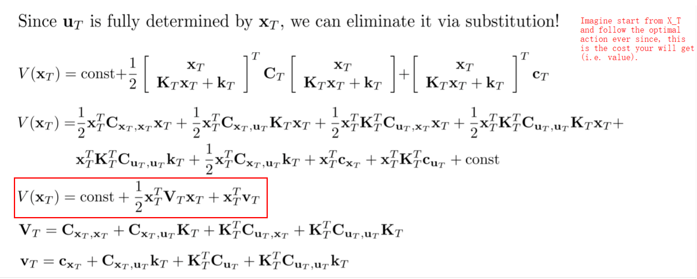

  - :two: Solve for $\mathbf{u}_{T-1}$ in terms of $\mathbf{x}_{T-1}$, and remember $\mathbf{u}_{T-1}$ affects $\mathbf{x}_T$!
    - 
    - 
  - :three: The algorithm:
    - 
    - `Note`:
      - $Q(\mathbf{x}_t,\mathbf{u}_t)$ = total cost from now until end if we take $\mathbf{u}_t$ from state $\mathbf{x}_t$.
      - $V(\mathbf{x}_t)$ = total cost from now until end from state $\mathbf{x}_t$. ($ V\left(\mathbf{x}_{t}\right)=\min\limits_{\mathbf{u}_{t}} Q\left(\mathbf{x}_{t}, \mathbf{u}_{t}\right) $)
- LQR for stochastic and nonlinear systems:
  - **Stochastic dynamics**:
    - 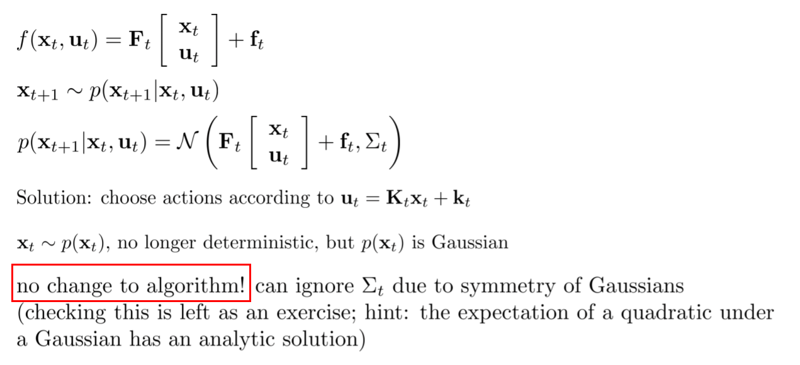
    - In this setting, you are **NOT** getting a single sequence of states and actions (open-loop plan), but a closed form control law (closed-loop plan). 
  - **Non-linear case: DDP/iterative LQR**:
    - 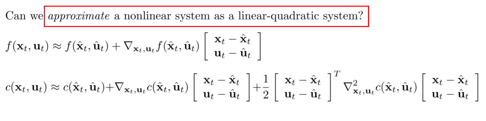
    - 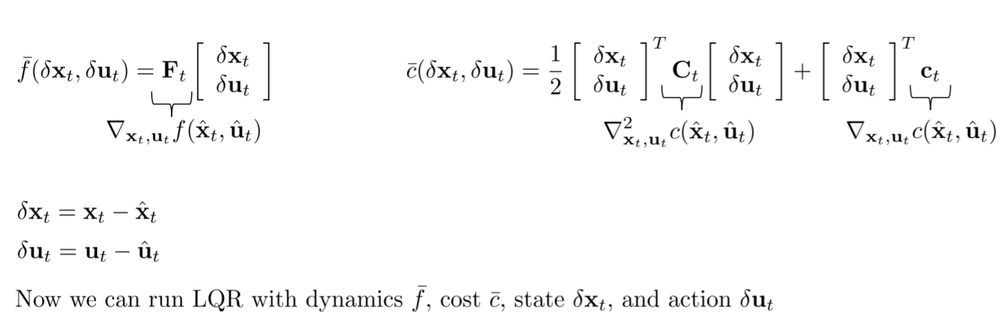
    - Algorithm:
      - 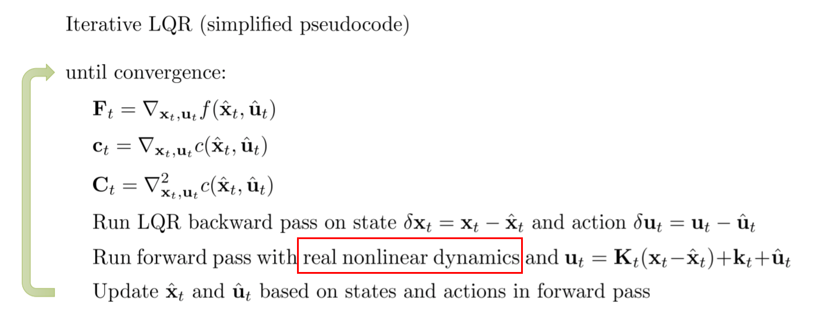
    - `Interpretation of the algorithm:`
      - 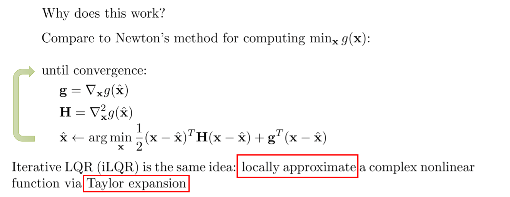
      -  In fact, iLQR is an approximation of Newton's method for solving: 
        $ \min\limits_{\mathbf{u}_{1}, \ldots, \mathbf{u}_{T}} c\left(\mathbf{x}_{1}, \mathbf{u}_{1}\right)+c\left(f\left(\mathbf{x}_{1}, \mathbf{u}_{1}\right), \mathbf{u}_{2}\right)+\cdots+c\left(f(f(\ldots) \ldots), \mathbf{u}_{T}\right) $, but it **doesn't** use second order derivative when approximating dynamics $f(\cdot,\cdot)$.
      - To get Newton's method, need to use **second order dynamics approximation**:
        $ f\left(\mathbf{x}_{t}, \mathbf{u}_{t}\right) \approx f\left(\hat{\mathbf{x}}_{t}, \hat{\mathbf{u}}_{t}\right)+\nabla_{\mathbf{x}_{t}, \mathbf{u}_{t}} f\left(\hat{\mathbf{x}}_{t}, \hat{\mathbf{u}}_{t}\right)\left[\begin{array}{l}\delta \mathbf{x}_{t} \\ \delta \mathbf{u}_{t}\end{array}\right]+\frac{1}{2}\left(\nabla_{\mathbf{x}_{t}, \mathbf{u}_{t}}^{2} f\left(\hat{\mathbf{x}}_{t}, \hat{\mathbf{u}}_{t}\right) \cdot\left[\begin{array}{l}\delta \mathbf{x}_{t} \\ \delta \mathbf{u}_{t}\end{array}\right]\right)\left[\begin{array}{l}\delta \mathbf{x}_{t} \\ \delta \mathbf{u}_{t}\end{array}\right] $
        - This is differential dynamic programming (DDP).
    - An improvement: 
      - 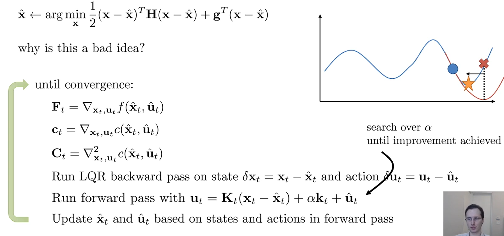

## 10.5. Case Study and Additional Readings

> [Synthesis and stabilization of complex behaviors through online trajectory optimization](https://ieeexplore.ieee.org/abstract/document/6386025/)

- All the tricks and tips for implementing iLQR.

---

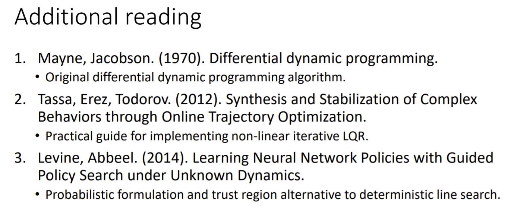

