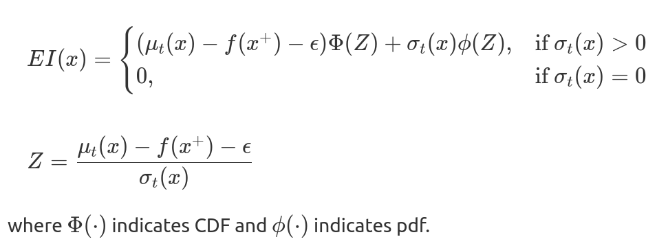
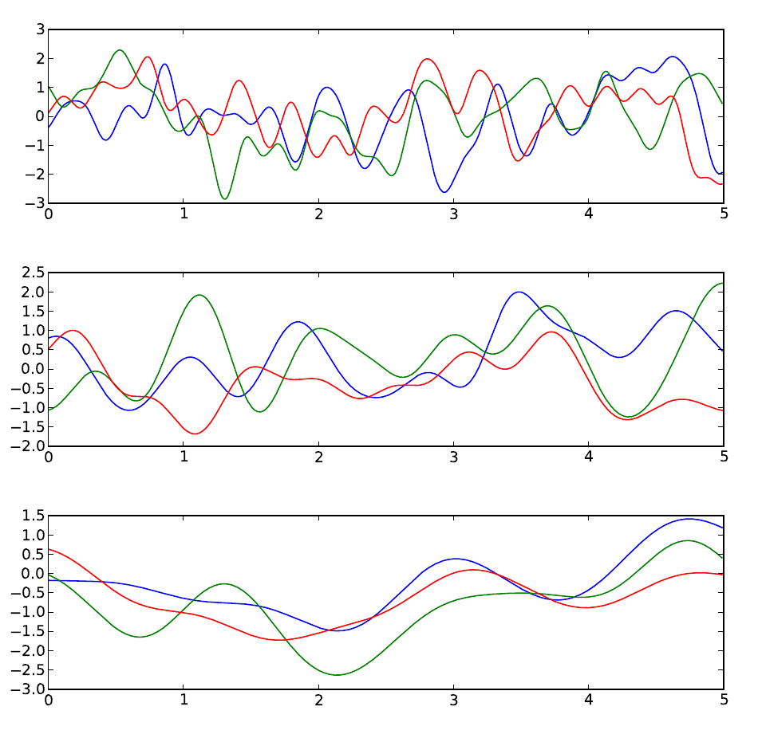

# Resources

- Thompson Sampling && GP
    - https://gdmarmerola.github.io/ts-for-bayesian-optim/
    - http://katbailey.github.io/post/gaussian-processes-for-dummies/

# [Exploring Bayesian Optimization](https://distill.pub/2020/bayesian-optimization/)

### Overview of Active Learning and Bayesian Optimization

- Active learning: drill at where has **high information**
- Bayesian optimization: drill at where has **high promise/value**

### Active Learning

- Minimize labeling **costs** while maximizing modeling **accuracy**.
- One approach: *uncertainty reduction*:
    - true value at some points -> formalize a *surrogate model* (e.g. Gaussian Process)
    - pick points with highest **uncertainty**
    - update GP w.r.t. new data

### Bayesian Optimization

- Only care about digging **more gold** instead accuracy (so we do not waste time measuring places where clearly has less gold)
- Balance **places with high uncertainty** && **places we know have more gold**.
    - places with high certainty might have great gold (as well) 
- :arrow_down:
- Acquisition functions: at every step, we determine what the best point to evaluate next is according to the acquisition function by **optimizing it**.

#### General constraints of Bayesian Optimization

- $f$'s feasible set $A$ is simple, e.g. box constraints. (定义域)
- $f$'s continuous but lacks special structure, e.g., concavity, that would make it easy to optimize.
- $f$'s is derivative-free: evaluations do **NOT** give gradient information.
- $f$ is expensive to evaluate.
- $f$' may be noisy. (if noise is present. we will assume it's independent and normally distributed, with common but unknown variance.)

#### Formalization of Bayesian Optimization:

- Choose surrogate model for modeling true function $f$ and define its **prior**.
- Use Bayes rule for updating and acquire **posterior** w.r.t. **observation**
- Use an acquisition function $\alpha(x)$, a function of the **posterior**, to decide the next sample point $x_t = argmax_x\alpha(x)$ (?How to do this in continuous?)
- Add new data to **observation** and do this again.

#### Acquisition Function

##### Probability of improvement (PI)

- $x_t$: point that has the highest **probability of improvement** over the current max $f(x^{+}) = argmax_{x_i\in x_{1:t}}f(x_i)$
    - $x_{t+1} = argmax(\alpha_{PI}(x)) = argmax(P(f(x) \geq (f(x^+) +\epsilon)))$
- NOTE: 原文中的$\Phi$应该是标准正态的CDF所以要归一化
- Intuition behind $\epsilon$ in **PI**
    - PI uses *epsilon* to strike a balance between exploration and exploitation.
    - Increasing $\epsilon$ results in querying locations with larger $\sigma$ (explore more)
        - as their probability density is spread.
        - if $\epsilon$ is too large, BO becomes something like AL.

##### Expected Improvement (EI)

- PI overlooks *how much* we can improve.
    - $x_{t+1} = argmin_x \mathbb{E}( ||h_{t+1}(x) - f(x^\star) || \ | \ \mathcal{D}_t)$
        - where $f$ is the actual ground truth, $h_{t+1}$ is the posterior of the surrogate at ${t+1}^{th}$ timestep, $\mathcal{D}_t$ is the training data, and $x^*$ is the **actual position** where $f$ takes the maximum value.
        - we want to minimize the distance between selected points and actual global maximum $x^*$. (however we do not know that) 
- An alternative for that we do not know $x^*$:
    - $x_{t+1} = argmax_x \mathbb{E} ( {max} \{ 0, \ h_{t+1}(x) - f(x^+) \} \ | \ \mathcal{D}_t)$
        - where $f(x^+)$ is the maximum value that has been encountered so far
    - for GP:
        - 
        - w.r.t expectation (the first term) and uncertainty (the second term)
    - increase $\epsilon$ encourages exploring.
    - intuitively, $\alpha_{PI}$ denotes the risk and $\alpha_{EI}$ denotes the reward.

##### Thompson Sampling

- At every step, we **sample a function** from the surrogate's posterior and optimize it.
- Intuition for Thompson Sampling:
    - Location's with high uncertainty ($\sigma(x)$) has a non-trivial probability that a sample can take high value in a highly uncertain region (and thus encourage **exploration**)
    -  Sampled functions must **pass sampled points** (including current maximum point), and thus **exploitation**.

##### Random

- random sampling.

##### Other Acquisition Functions

- **Upper Confidence Bound (UCB)**
    - a linear combination of exploitation and exploration
    - $\alpha(x) = \mu(x) + \lambda \times \sigma(x)$

- **Probability of Improvement + λ × Expected Improvement (EI-PI)**
    - $\alpha(x) = \alpha_{PI}(x) + \lambda \times \alpha_{EI}(x)$

- **Gaussian Process Upper Confidence Bound (GP-UCB)**
    - $\alpha_{GP-UCB}(x) = \mu_t(x) + \sqrt{\beta_t}\sigma_t(x)$
    - Srinivas et. al. developed a schedule for $\beta$ that they theoretically demonstrate to minimize **cumulative regret.** (regret: difference between the actual maximize and the value we receive)

#### Hyper-parameter Tuning

- We can treat *evaluating a model* as *digging a hole* (cost), so hyper-parameter is also a problem for exploration / exploiting with budget.

### Summary

- **Bayesian Optimization** for  optimizing a **black-box** function.
    - surrogate function
    - Bayes: use data for obtaining posterior.
    - Acquisition functions.

# Multi-armed bandits

- Greedy algorithm:

    - compute the expected reward (mean reward), and do $\epsilon-greedy$.
    - waste resources by failing to write off actions regardless of how unlikely they are to be optimal

-  Thompson algorithm:

    - not use the expected reward / mean, but use **sampling**.

- Use beta-distribution for surrogate function

    - update rule:

        - $$
            \alpha \leftarrow \alpha + r \\
            \beta \leftarrow \beta + 1 - r \\
            \\r \in [0,1]
            $$

# [A Tutorial on Bayesian Optimization of Expensive Cost Functions, with Application to Active User Modeling and Hierarchical Reinforcement Learning](https://arxiv.org/pdf/1012.2599.pdf)

# Bayes' Theorem

- M: the *posterior* probability of a model (or theory, or hypothesis)
- E: evidence (or data, or observations)

$$
P(M|E) \propto P(E|M)P(M)
$$

# Where's the Bayesian part in GP?

- https://stats.stackexchange.com/questions/84167/is-gaussian-process-regression-a-bayesian-method
- The very thing which makes GP a Bayesian approach is that, *it specifies a Prior, and the Gaussian conditional acts as the Posterior*.
  - Think about Gaussian a distribution over functions, we add observed data, then the distribution changed (using Gaussian conditional):
    - 
  - Actually in GP, the $P(M|E) = P(M|(x_i,y_i)_N) =  P(x_1,y_1, \cdots, x_N,y_N)$ (Gaussian joint probability) is **not** what we care, what we care is $P(f|M)$.
    - Because GP is non-parametrized, so we don't care how to apply the Bayes' chain rule for updating $M$ (you can think that $M$ is updated using new data automatically), but how to use the posterior for prediction. :

